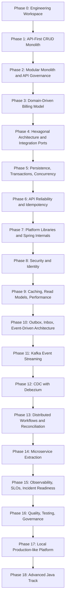

# 🧭 Atlas Billing Platform
## A Staff Engineer / Java Architect Learning Blueprint
### Integrated Phase-Based Edition

> **Goal:** Build one realistic software platform locally, evolving it from a simple Spring Boot CRUD application into a production-grade billing platform.  
> **Audience:** Senior Java Engineer progressing toward Staff Engineer, Lead Engineer, or Software Architect.  
> **Constraint:** Everything must run on a local laptop using free and open-source tools. Cloud concepts are learned through local equivalents first.  
> **Principle:** Every concept is introduced only when the product creates a real reason for it.

---

## 1. Executive Summary

This is not a study roadmap and not a list of disconnected exercises.

You are building one product over time:

# **Atlas Billing Platform**

A fictional B2B SaaS company needs a billing platform that manages:

- customers
- subscription plans
- subscriptions
- invoices
- payments
- failed payment retries
- account balances
- financial ledger entries
- fraud checks
- notifications
- audit history
- reporting
- internal service communication
- production-like operations

The platform starts as a simple monolith and evolves because the business creates pressure:

| Product Pressure | Engineering Response |
|---|---|
| Customers need to subscribe to plans | CRUD, validation, persistence, OpenAPI |
| Invoices must be financially correct | transactions, invariants, ledger, locking |
| Clients retry payment requests | idempotency keys, response replay, duplicate protection |
| APIs grow and clients depend on them | versioning, compatibility, pagination, ETags |
| Async workflows appear | outbox, inbox, event envelopes, idempotent consumers |
| Kafka is introduced | partitions, ordering keys, offsets, schemas, DLQ |
| Data extraction must scale | CDC, Debezium, PostgreSQL WAL |
| Payment becomes a distributed workflow | saga, compensation, reconciliation |
| Payment changes faster than billing | microservice extraction, contracts, resilience |
| Incidents become hard to diagnose | logs, metrics, traces, SLOs, runbooks |
| Teams grow | modular boundaries, ADRs, governance, fitness functions |

The purpose is to learn **how experienced Staff Engineers evolve architecture**, not how to use tools in isolation.

---

## 2. Core Local Technology Stack

| Area | Technology |
|---|---|
| Language | Java 21 baseline, with optional Java 25 notes |
| Framework | Spring Boot |
| Build | Maven multi-module, parent POM, BOM, Enforcer |
| API | REST, OpenAPI, RFC 7807 Problem Details |
| Database | PostgreSQL |
| ORM | Spring Data JPA / Hibernate |
| SQL-first access | Spring Data JDBC where useful |
| Migrations | Flyway |
| Messaging | Apache Kafka in KRaft mode |
| Event extraction | Transactional Outbox first, Debezium CDC later |
| Cache | Caffeine and Redis |
| Security | Keycloak, OAuth2, OpenID Connect, JWT |
| Resilience | Resilience4j |
| Observability | OpenTelemetry, Prometheus, Grafana, Loki, Tempo |
| Testing | JUnit 5, AssertJ, Mockito, Testcontainers, WireMock, ArchUnit, Pact |
| Performance | JFR, JMC, VisualVM, JMH, JMeter or Gatling |
| Code Quality | Spotless, Checkstyle, SpotBugs, PMD, JaCoCo, SonarQube Community |
| Security Scanning | OWASP Dependency Check, Trivy, Gitleaks, SBOM generation |
| Feature Flags | Togglz, FF4J, or simple database-backed flags |
| Local Runtime | Docker Compose profiles |
| Optional Final Platform | kind Kubernetes cluster |

---

## 3. Architecture Evolution Timeline



---

# Phase 0 — Engineering Workspace Foundation

## Business Goal

Create a consistent local development environment so any developer can clone the repository, run the platform, and trust the build.

## Technical Goal

Establish project structure, build governance, dependency control, code quality checks, and local automation before business code grows.

## Why This Phase Exists

Most architecture problems start quietly: inconsistent dependencies, slow builds, broken local environments, missing quality gates, or undocumented setup steps.

At Staff Engineer level, the build is part of the architecture.

## Concepts Introduced Naturally

| Concept | Why It Appears Now |
|---|---|
| Maven reactor | Multiple modules need deterministic build ordering |
| Parent POM | Common plugin and build configuration must be centralized |
| BOM | Dependency versions must not drift across modules |
| Maven Enforcer | Java version and dependency convergence must be enforced |
| Plugin management | Build behavior should be predictable |
| Reproducible builds | Same source should create same artifact |
| Spotless / Checkstyle / PMD / SpotBugs | Code quality should not depend only on review comments |
| JaCoCo | Test coverage visibility starts from day one |
| OWASP Dependency Check | Dependency risk must be visible early |
| Gitleaks | Secrets must not enter Git history |
| Trivy | Container images will eventually need scanning |
| SBOM | Supply-chain visibility starts before release pressure |
| Makefile | Common local commands reduce onboarding friction |
| ADR template | Decisions should be captured while context is fresh |

## Target Repository Structure

```text
atlas-billing-platform/
  platform/
    platform-bom/
    platform-parent/
    platform-starters/
  shared/
  apps/
    billing-app/
  services/
  infrastructure/
    docker/
  observability/
  devops/
  docs/
    adr/
    runbooks/
  scripts/
  sandbox/
```

## Practical Implementation Tasks

- Create the root repository.
- Create a Maven multi-module structure.
- Create `platform-parent` for common build configuration.
- Create `platform-bom` for dependency version alignment.
- Add Maven Enforcer rules:
  - Java version
  - dependency convergence
  - banned dependencies
  - duplicate classes
- Add Spotless formatting.
- Add Checkstyle rules.
- Add SpotBugs and PMD.
- Add JaCoCo with low initial thresholds.
- Add OWASP Dependency Check.
- Add Gitleaks.
- Add Trivy configuration for future container images.
- Add SBOM generation using CycloneDX Maven plugin.
- Add Makefile commands:

```bash
make build
make test
make verify
make up
make down
make logs
make clean
```

## Architectural Decision

### Decision

Use a Maven multi-module monorepo.

### Why

At the beginning, refactoring speed matters more than independent deployment. Boundaries are still being discovered.

### Alternatives Considered

| Alternative | Why Not Yet |
|---|---|
| Many repositories | Too much coordination before service boundaries are proven |
| Gradle | Good option, but Maven is common in enterprise Java and simpler for this path |
| Single flat project | Becomes hard to govern once modules grow |

### Trade-Offs

| Benefit | Cost |
|---|---|
| Fast refactoring | Repository can become large |
| Centralized dependency governance | Requires discipline |
| Easier local onboarding | Initial setup takes time |

## Testing and Acceptance Gate

| Check | Acceptance Criteria |
|---|---|
| Build | `mvn clean verify` succeeds |
| Formatting | Spotless check passes |
| Dependency health | Enforcer and dependency check pass |
| Security hygiene | Gitleaks finds no secrets |
| Documentation | ADR template exists |

## Staff Engineer Lens

- The build system is a control plane for engineering quality.
- Architecture rules that are not automated become suggestions.
- Dependency drift is cheaper to prevent than to repair.

---

# Phase 1 — API-First CRUD Monolith

## Business Goal

The company needs to onboard customers, define subscription plans, create subscriptions, and generate simple invoices quickly.

## Technical Goal

Build the smallest working product while establishing API and persistence habits that will scale later.

## Scope

One Spring Boot application:

```text
apps/billing-app
```

Initial capabilities:

- create customer
- create plan
- create subscription
- list subscriptions
- generate simple invoice

## Concepts Introduced Naturally

| Concept | Why It Appears Now |
|---|---|
| Spring Boot REST controllers | The product needs HTTP APIs |
| OpenAPI contract | Clients need a stable description of the API |
| DTOs | API models must not expose persistence internals |
| Validation | Bad requests should be rejected at the boundary |
| RFC 7807 Problem Details | Error responses should be consistent from the beginning |
| Global exception handling | Every endpoint should fail in the same shape |
| Spring Data JPA | CRUD persistence is fast to build |
| Hibernate basics | Entity state and dirty checking appear immediately |
| PostgreSQL | The local DB should behave like production-like SQL |
| Flyway | Schema changes must be versioned |
| `@Transactional` | Business operations need atomicity |
| Pagination | List endpoints should not return unbounded data |
| Filtering and sorting | Real clients need useful query APIs |
| Database constraints | Important invariants belong in the database too |
| Testcontainers | Integration tests should use real PostgreSQL, not H2 assumptions |

## Initial API Design

```http
POST /api/v1/customers
GET  /api/v1/customers/{customerId}
POST /api/v1/plans
GET  /api/v1/plans?page=0&size=20&sort=name,asc
POST /api/v1/subscriptions
GET  /api/v1/customers/{customerId}/subscriptions?page=0&size=20
POST /api/v1/invoices/generate
```

## Practical Implementation Tasks

- Create `CustomerEntity`, `PlanEntity`, `SubscriptionEntity`, and `InvoiceEntity`.
- Create request/response DTOs as Java records.
- Add OpenAPI documentation.
- Add validation annotations.
- Add a global exception handler returning Problem Details.
- Add Flyway migration `V1__init_schema.sql`.
- Add database constraints:
  - not-null constraints
  - unique customer email
  - positive plan price
  - valid subscription status
- Add pagination to list endpoints.
- Add filtering for subscriptions by status.
- Add sorting for plans and invoices.
- Add integration tests with PostgreSQL Testcontainers.

## Architectural Decision

### Decision

Start with one deployable Spring Boot monolith and one PostgreSQL database.

### Why

The fastest way to validate the product is to keep deployment, debugging, and transactions simple.

### Alternatives Considered

| Alternative | Why Not Yet |
|---|---|
| Microservices | Domain boundaries are not known yet |
| Kafka-first design | No async pressure exists yet |
| CQRS | Read/write models are simple at this point |
| No OpenAPI | Client integration becomes guesswork |

### Trade-Offs

| Benefit | Cost |
|---|---|
| Fast delivery | Internal boundaries can become weak |
| Easy debugging | One app can become too large later |
| Simple ACID transactions | Scaling is mostly vertical early |

## Testing and Acceptance Gate

| Test Type | What It Proves |
|---|---|
| Unit tests | Basic billing calculations work |
| Controller tests | Request validation and error responses work |
| Integration tests | JPA mappings and Flyway schema work on PostgreSQL |
| API contract check | OpenAPI is generated and usable |

Acceptance criteria:

- `mvn verify` passes.
- The app starts with local PostgreSQL.
- OpenAPI UI exposes all endpoints.
- Invalid requests return Problem Details.
- List endpoints are paginated.

## Staff Engineer Lens

- A monolith is not a failure. An unstructured monolith is.
- API habits begin before the first external consumer appears.
- Database constraints are not duplication; they are defense in depth.

---

# Phase 2 — Modular Monolith and API Governance

## Business Goal

The product grows. Different areas now need independent ownership:

- customer management
- catalog
- subscriptions
- invoicing
- payments
- ledger
- notifications

## Technical Goal

Prevent the monolith from becoming a big ball of mud while keeping one deployable application.

## Concepts Introduced Naturally

| Concept | Why It Appears Now |
|---|---|
| Modular monolith | Teams need boundaries before services exist |
| Package-private implementation | Internals should stay hidden |
| Public module APIs | Modules should collaborate through explicit contracts |
| Dependency direction rules | Architecture must prevent random coupling |
| ArchUnit | Boundary rules must be executable |
| API versioning | Clients will depend on endpoint behavior |
| Backward-compatible API changes | API evolution must not break consumers |
| API deprecation strategy | Old APIs need a planned retirement path |
| ETag | Clients need efficient reads and cache validation |
| `If-Match` | Updates need optimistic concurrency at the API boundary |
| Consumer-driven API evolution | Client needs influence API compatibility |
| ADR lifecycle | Decisions need ownership and review, not just files |
| Module ownership | Boundaries need responsible maintainers |

## Module Layout

```text
apps/billing-app/src/main/java/com/atlas/billing/
  customer/
    api/
    internal/
  catalog/
    api/
    internal/
  subscription/
    api/
    internal/
  invoice/
    api/
    internal/
  payment/
    api/
    internal/
  ledger/
    api/
    internal/
  notification/
    api/
    internal/
```

## Practical Implementation Tasks

- Move code into capability-based packages.
- Hide repositories and entities inside `internal` packages.
- Expose one public API per module.
- Add ArchUnit rules that prevent direct repository access across modules.
- Add an API versioning convention:

```text
/api/v1/...
/api/v2/...
```

- Add response headers for deprecation:

```http
Deprecation: true
Sunset: Wed, 31 Dec 2026 23:59:59 GMT
```

- Add ETag support for customer, plan, and subscription read endpoints.
- Add `If-Match` checks for update commands.
- Add optimistic concurrency errors as Problem Details.
- Add ADR status values:
  - Proposed
  - Accepted
  - Superseded
  - Deprecated

## Architectural Decision

### Decision

Keep one deployable app, but enforce internal module boundaries and API governance.

### Why

The system needs architectural discipline before operational distribution.

### Alternatives Considered

| Alternative | Why Not Yet |
|---|---|
| Extract microservices | Adds network, deployment, data consistency, and observability costs too early |
| Keep technical layers only | `controller/service/repository` packages hide domain ownership |
| No API governance | Versioning pain appears later when clients exist |

### Trade-Offs

| Benefit | Cost |
|---|---|
| Strong boundaries without distributed systems | More package discipline |
| Easier future extraction | More explicit APIs required |
| Safer API evolution | More tests and documentation |

## Testing and Acceptance Gate

| Test Type | What It Proves |
|---|---|
| ArchUnit tests | Module rules are enforced |
| API compatibility tests | v1 behavior does not break accidentally |
| ETag tests | Conditional reads and updates work |
| Contract smoke tests | API shape remains stable |

Acceptance criteria:

- Payment code cannot directly access invoice repositories.
- External API DTOs do not expose JPA entities.
- Conditional update with stale `If-Match` fails safely.
- ADRs exist for module boundaries and API versioning.

## Staff Engineer Lens

- A module boundary is a social boundary before it becomes a deployment boundary.
- Versioning is not only a URL problem; it is a compatibility promise.
- Good architecture prevents accidental shortcuts.

---

# Phase 3 — Domain-Driven Billing Model

## Business Goal

Billing rules become more complex:

- free trials
- discounts
- taxes
- subscription suspension
- failed payment retries
- invoice state transitions
- payment state transitions
- account balance corrections

## Technical Goal

Move important business rules out of procedural services and into expressive domain objects.

## Concepts Introduced Naturally

| Concept | Why It Appears Now |
|---|---|
| Bounded context | Billing, catalog, payment, and ledger have different language |
| Ubiquitous language | Engineers and business users need shared terms |
| Aggregate | Invariants need consistency boundaries |
| Entity | Objects with identity evolve over time |
| Value object | Money, IDs, periods, and tax rates need correctness |
| Domain service | Some rules do not naturally belong to one entity |
| Domain event | State changes need to be captured |
| Invariant | Billing correctness requires protected rules |
| State machine thinking | Invoice and payment status transitions must be legal |
| Sealed classes | Java can model limited state hierarchies clearly |
| Records | Commands, IDs, events, and DTOs become immutable |
| Exception taxonomy | Business failures and technical failures should differ |

## Domain Model

```text
Customer
Plan
Subscription
Invoice
Payment
LedgerAccount
LedgerEntry
```

## Value Objects

```text
Money
Currency
CustomerId
SubscriptionId
InvoiceId
PaymentId
TaxRate
BillingPeriod
IdempotencyKey
CorrelationId
```

## Practical Implementation Tasks

- Create immutable `Money`.
- Add currency-safe arithmetic.
- Add `Subscription.activate()`.
- Add `Subscription.cancel()`.
- Add `Subscription.suspendForFailedPayment()`.
- Add `Invoice.markIssued()`.
- Add `Invoice.markPaid()`.
- Add `Invoice.markOverdue()`.
- Add `Payment.authorize()`.
- Add `Payment.capture()`.
- Add `Payment.fail()`.
- Add sealed classes or enums for invoice and payment states.
- Add domain events:

```text
SubscriptionCreated
SubscriptionCancelled
InvoiceGenerated
InvoicePaid
PaymentAuthorized
PaymentSucceeded
PaymentFailed
LedgerEntryPosted
```

- Add a clear exception taxonomy:

```text
BusinessRuleViolationException
ConflictException
NotFoundException
ExternalDependencyException
RetryableTechnicalException
NonRetryableTechnicalException
```

## Architectural Decision

### Decision

Use rich domain models for subscription, invoice, payment, and ledger behavior.

### Why

Billing logic becomes risky when scattered across controllers and procedural service methods.

### Alternatives Considered

| Alternative | Why Not Yet |
|---|---|
| Anemic model | Easy at first, but business rules become procedural spaghetti |
| Rules engine | Too heavy before rule complexity justifies it |
| Stored procedures | Harder to test and refactor as the model evolves |

### Trade-Offs

| Benefit | Cost |
|---|---|
| Better business expressiveness | More mapping code |
| Easier unit testing | Requires modeling discipline |
| Framework-independent rules | More upfront design thinking |

## Testing and Acceptance Gate

| Test Type | What It Proves |
|---|---|
| Pure unit tests | Domain rules work without Spring |
| State transition tests | Invalid invoice/payment transitions are rejected |
| Property-style tests | Money calculations preserve invariants |
| Exception tests | Business and technical failures are distinct |

Acceptance criteria:

- Domain tests run without Spring.
- Invalid payment and invoice state transitions fail.
- Money cannot mix currencies accidentally.
- Application services orchestrate domain behavior instead of containing all rules.

## Staff Engineer Lens

- Domain modeling is not academic when money is involved.
- A clean domain model reduces future service extraction risk.
- Invariants should live where they cannot be accidentally skipped.

---

# Phase 4 — Hexagonal Architecture and Integration Ports

## Business Goal

The company expects future changes:

- different payment providers
- different notification providers
- REST and event-based inputs
- different persistence approaches
- integrations with legacy finance systems

## Technical Goal

Decouple business behavior from frameworks, persistence, messaging, and external systems.

## Concepts Introduced Naturally

| Concept | Why It Appears Now |
|---|---|
| Ports and adapters | The domain should not depend on infrastructure |
| Dependency inversion | Business rules should define what they need |
| Inbound adapter | REST, scheduled jobs, and events trigger use cases |
| Outbound adapter | Databases and providers implement domain needs |
| Application service | Use cases coordinate transactions and ports |
| Anti-corruption layer | External models should not leak into the domain |
| Persistence mapper | JPA entities should not become the domain model |
| Command object | Use cases should receive clear intent |
| Query object | Reads should be explicit and optimized independently |
| MapStruct | Mapping becomes repetitive and needs consistency |
| Application events vs domain events | Internal notifications differ from business facts |

## Target Module Structure

```text
subscription/
  domain/
  application/
    command/
    query/
    service/
  port/
    in/
    out/
  adapter/
    in/
      web/
      messaging/
      scheduler/
    out/
      postgres/
      paymentprovider/
      notification/
```

## Practical Implementation Tasks

Create inbound ports:

```text
CreateSubscriptionUseCase
CancelSubscriptionUseCase
GenerateInvoiceUseCase
RegisterPaymentResultUseCase
```

Create outbound ports:

```text
LoadCustomerPort
LoadPlanPort
SaveSubscriptionPort
SaveInvoicePort
PaymentProviderPort
LedgerPostingPort
NotificationPort
```

Implement adapters:

- REST controllers as inbound adapters.
- Scheduled invoice generation as inbound adapter.
- JPA repositories as outbound adapters.
- Payment provider stub as outbound adapter.
- Notification stub as outbound adapter.
- MapStruct mappers for DTO/domain/entity conversion.
- Anti-corruption layer for payment provider response mapping.

## Architectural Decision

### Decision

Use hexagonal architecture inside important modules, not blindly everywhere.

### Why

The payment, invoice, subscription, and ledger areas have real reasons to change independently from infrastructure.

### Alternatives Considered

| Alternative | Why Not Yet |
|---|---|
| Traditional controller-service-repository everywhere | Framework and persistence concerns leak into business logic |
| Full clean architecture with many rings | Too much ceremony for simple modules |
| JPA entities as domain | Faster early, but couples persistence to business rules |

### Trade-Offs

| Benefit | Cost |
|---|---|
| Replaceable infrastructure | More classes |
| Testable business logic | More mapping |
| Clear use cases | Slower initial coding |

## Testing and Acceptance Gate

| Test Type | What It Proves |
|---|---|
| Use-case tests | Application logic works through ports |
| Adapter tests | Persistence and provider adapters behave correctly |
| Mapper tests | DTO/domain/entity conversions are safe |
| Architecture tests | Dependencies point inward |

Acceptance criteria:

- Domain code imports no Spring, JPA, Kafka, or HTTP classes.
- External provider DTOs do not leak into domain objects.
- Use cases can be tested with fake ports.

## Staff Engineer Lens

- Hexagonal architecture is valuable when change pressure exists.
- Ports are not abstractions for their own sake; they protect business policy.
- Anti-corruption layers are essential when integrating with external systems.

---

# Phase 5 — Persistence, Transactions, and Concurrency

## Business Goal

Payments, invoices, and ledger entries must remain correct when multiple requests happen at the same time.

## Technical Goal

Learn real transaction boundaries, locking, consistency, migrations, and database performance.

## Concepts Introduced Naturally

| Concept | Why It Appears Now |
|---|---|
| ACID | Financial operations require atomic consistency |
| Transaction boundary design | Too-wide and too-narrow transactions both create problems |
| Transaction propagation | Nested use cases need clear behavior |
| `@Transactional` self-invocation issue | Spring proxies can be bypassed accidentally |
| Transaction synchronization | Some work must happen after commit |
| Isolation levels | Race conditions depend on database isolation |
| Optimistic locking | Prevent lost updates on subscriptions and invoices |
| Pessimistic locking | Serialize critical payment finalization |
| Deadlocks | Concurrent ledger posting can lock rows in different order |
| Unique constraint race handling | Correctness must survive concurrent inserts |
| Hibernate dirty checking | Entity changes are flushed automatically |
| Persistence context size | Large transactions can consume memory |
| `flush()` behavior | SQL execution timing matters |
| Lazy initialization exception | Entity loading cannot be accidental |
| Fetch join | Solve targeted N+1 cases |
| Entity graph | Control loading without hardcoding every query |
| Batch fetching | Optimize collections |
| DTO projections | Avoid loading full aggregates for read screens |
| Index design | Queries need access paths |
| Composite indexes | Multi-column filters need intentional indexes |
| Partial indexes | Some queries only need active rows |
| Covering indexes | Avoid unnecessary table lookups |
| Keyset pagination | Large invoice lists should not use slow offsets |
| Zero-downtime migration | Schema changes must not require app downtime |
| Expand-contract migration | Old and new code must overlap safely |
| Backfill | Existing data must migrate without blocking the system |
| Database rollback limitation | Data migrations are not as easy to roll back as code |

## Ledger Design

Use an append-only double-entry ledger instead of relying only on mutable balance fields.

```text
ledger_entries
  id
  account_id
  invoice_id
  payment_id
  direction: DEBIT | CREDIT
  amount
  currency
  created_at
  correlation_id
```

## Practical Implementation Tasks

- Create `ledger_accounts` and `ledger_entries` tables.
- Add debit and credit entries in the same transaction.
- Add optimistic locking with `@Version` on subscription and invoice records.
- Add pessimistic locking for payment finalization.
- Add a consistent lock ordering rule to reduce deadlocks.
- Add unique constraints for business invariants.
- Add retry logic for optimistic lock conflicts where safe.
- Add query optimization using `EXPLAIN ANALYZE`.
- Add keyset pagination for invoice listing.
- Implement an expand-contract migration:
  1. expand schema with nullable column
  2. deploy code that writes both old and new fields
  3. backfill old rows
  4. switch reads to new field
  5. contract/remove old field later
- Compare offset pagination vs keyset pagination.

## Architectural Decision

### Decision

Use append-only ledger entries and database-enforced constraints for financial correctness.

### Why

Financial history must be auditable, reconstructable, and resistant to accidental mutation.

### Alternatives Considered

| Alternative | Why Not Yet |
|---|---|
| Mutable balance only | Easy to corrupt and hard to audit |
| Java `synchronized` | Fails with multiple app instances |
| Distributed lock first | Operationally heavy before local DB constraints are exhausted |
| No expand-contract migrations | Causes deployment coupling and downtime risk |

### Trade-Offs

| Benefit | Cost |
|---|---|
| Strong auditability | More complex queries |
| Better correctness | Requires ledger thinking |
| Safer deployments | More migration steps |

## Testing and Acceptance Gate

| Test Type | What It Proves |
|---|---|
| Concurrent integration tests | Race conditions do not corrupt payments |
| Migration tests | Flyway migrations work from empty and existing schemas |
| Repository tests | Queries and mappings behave correctly |
| Performance tests | Indexes improve real query plans |
| Deadlock simulation | Lock ordering reduces failures |

Acceptance criteria:

- 50 concurrent payment finalization attempts do not double-post ledger entries.
- Stale updates fail with a clear conflict error.
- Invoice listing uses keyset pagination for large datasets.
- Expand-contract migration is documented in an ADR.

## Staff Engineer Lens

- Database constraints are part of the architecture.
- Correctness beats cleverness in financial systems.
- Zero-downtime migration is a deployment design problem, not only a database task.

---

# Phase 6 — API Reliability and Idempotency

## Business Goal

Clients retry payment and invoice requests after timeouts. The system must not double-charge, double-generate invoices, or return inconsistent responses.

## Technical Goal

Make external APIs safe under retries, network failures, duplicate requests, and client misuse.

## Concepts Introduced Naturally

| Concept | Why It Appears Now |
|---|---|
| Idempotency key | Retried commands must not duplicate side effects |
| Idempotency key scope | Keys must be scoped by tenant, endpoint, and operation |
| Idempotency key expiry | Storage cannot grow forever |
| Request hash | Same key with different payload must be rejected |
| Response replay | Duplicate identical requests should return the original result |
| Unique constraint | Duplicate creation must be prevented atomically |
| Replay protection | Old keys should not be abused indefinitely |
| Correlation ID | Requests must be traceable across logs and events |
| Causation ID | Follow-up work should point to the triggering command |
| Rate limiting | Protect APIs from abusive or accidental traffic |
| Throttling | Slow clients down instead of hard failing everything |
| Timeout budget | Requests need clear maximum time boundaries |
| Deadline propagation | Downstream calls should know how much time remains |
| Retry budget | Retries must not amplify incidents |
| Exponential backoff | Retry pressure should reduce over time |
| Jitter | Avoid synchronized retry storms |
| Retry storm prevention | Reliability features can cause outages if uncontrolled |
| Bulk API design | Some operations should be batched intentionally |
| Webhook signature verification | Provider callbacks must be authenticated |
| Webhook replay protection | Old provider events should not be replayed maliciously |

## Idempotency Storage Model

```text
idempotency_records
  id
  tenant_id
  operation
  idempotency_key
  request_hash
  status: IN_PROGRESS | COMPLETED | FAILED
  http_status
  response_body
  locked_until
  expires_at
  created_at
```

## Practical Implementation Tasks

- Require `Idempotency-Key` for:
  - payment authorization
  - payment capture
  - invoice generation
  - subscription cancellation
- Scope the key by:

```text
tenantId + operation + idempotencyKey
```

- Store request hash and compare duplicates.
- Return the same response for duplicate identical requests.
- Reject same key with different payload using `409 Conflict`.
- Add expiry and cleanup job for old idempotency records.
- Handle `IN_PROGRESS` duplicate requests safely.
- Add correlation ID filter.
- Add causation ID to commands and events.
- Add rate limiting at the API layer using Bucket4j or Resilience4j RateLimiter.
- Add throttling for noisy clients.
- Add timeout configuration per endpoint type.
- Add retry policy with exponential backoff and jitter for safe outbound calls.
- Add webhook endpoint for payment provider events.
- Verify webhook signatures.
- Reject webhook replay attempts.

## Architectural Decision

### Decision

Require idempotency keys for side-effecting financial commands.

### Why

Network retries are normal. Duplicate financial side effects are unacceptable.

### Alternatives Considered

| Alternative | Why Not Enough |
|---|---|
| Disable button in frontend | Does not solve network retries or mobile reconnects |
| Database uniqueness only | Prevents duplicates but does not replay original response |
| Ignore duplicate requests | Financially unsafe |
| Make every endpoint idempotent by natural key only | Not always possible for commands |

### Trade-Offs

| Benefit | Cost |
|---|---|
| Safe retries | Extra storage |
| Better client experience | More edge cases |
| Prevents duplicate charges | Requires strict API rules |

## Testing and Acceptance Gate

| Test Type | What It Proves |
|---|---|
| Idempotency replay tests | Duplicate request returns original response |
| Payload mismatch tests | Same key with different request is rejected |
| Concurrent duplicate tests | Race conditions do not duplicate side effects |
| Rate-limit tests | Noisy clients are controlled |
| Webhook replay tests | Old or duplicated callbacks are rejected |
| Timeout tests | Requests fail predictably |

Acceptance criteria:

- Retried payment requests do not double-charge.
- Duplicate invoice generation returns the first response.
- Same idempotency key with a different payload returns a clear conflict.
- Rate-limited clients receive a standard error response.

## Staff Engineer Lens

- Idempotency is not one annotation. It is API design, storage, concurrency, and operations.
- Retries without budgets and jitter can make incidents worse.
- Correlation and causation IDs make reliability debuggable.

---

# Phase 7 — Platform Libraries and Spring Internals

## Business Goal

Repeated infrastructure logic appears across modules and future services:

- error handling
- logging
- validation
- security context
- JSON configuration
- idempotency
- caching
- tracing

## Technical Goal

Extract reusable platform capabilities carefully, without creating a giant dumping ground.

## Concepts Introduced Naturally

| Concept | Why It Appears Now |
|---|---|
| Internal platform libraries | Repeated infrastructure code needs consistency |
| Spring Boot starters | Future services need auto-configured behavior |
| Auto-configuration | Common behavior should be opt-in and conditional |
| Conditional beans | Starters must not override service-specific needs blindly |
| Spring bean lifecycle | Auto-configuration requires lifecycle understanding |
| Spring proxy internals | Transactions, security, and AOP depend on proxies |
| Filter vs interceptor vs aspect | Cross-cutting concerns run at different layers |
| AOP | Some technical policies can be applied declaratively |
| MDC | Logs need request context |
| ThreadLocal | Context propagation must be understood |
| ScopedValue | Safer context propagation with virtual threads |
| Virtual thread context propagation | ThreadLocal assumptions become dangerous |
| Jackson modules | Value objects need consistent serialization |
| Bean Validation groups | Different commands need different validation rules |
| Custom validation annotation | Domain-specific validation becomes reusable |
| ObjectMapper configuration | JSON compatibility must be controlled |
| Exception taxonomy reuse | Error behavior should be consistent |

## Platform Modules

```text
shared/
  common-core/
  common-errors/
  common-web/
  common-logging/
  common-validation/
  common-jackson/
  common-idempotency/
  common-security/
  common-cache/
  common-observability/

platform/
  platform-starters/
    web-starter/
    logging-starter/
    security-starter/
    idempotency-starter/
    observability-starter/
```

## Practical Implementation Tasks

- Create `common-errors` with exception taxonomy and Problem Details mapping.
- Create `common-web` with correlation ID filter and request logging.
- Create `common-logging` with MDC support and JSON logs.
- Create `common-jackson` with serializers for `Money`, IDs, and enums.
- Create `common-validation` with reusable validators.
- Create `common-idempotency` with reusable idempotency service and interceptor.
- Create `common-cache` with cache conventions.
- Create `common-observability` with trace and metric naming helpers.
- Create Spring Boot starters for common modules.
- Add auto-configuration tests using `ApplicationContextRunner`.
- Demonstrate Spring proxy pitfalls:
  - `@Transactional` self-invocation
  - AOP not applied to private methods
  - method security via proxy

## Architectural Decision

### Decision

Create focused shared libraries and starters only when duplication is proven.

### Why

Some concerns are genuinely cross-cutting. But uncontrolled shared code becomes a coupling trap.

### Alternatives Considered

| Alternative | Why Not Enough |
|---|---|
| Copy-paste everywhere | Inconsistent behavior |
| One giant common module | Becomes a dumping ground |
| External platform too early | More process than value |

### Trade-Offs

| Benefit | Cost |
|---|---|
| Consistent behavior | Versioning shared libraries matters |
| Faster service creation | Starters can hide complexity |
| Better governance | Risk of over-abstraction |

## Testing and Acceptance Gate

| Test Type | What It Proves |
|---|---|
| Auto-configuration tests | Starters load only when expected |
| Contract tests for common errors | Error shape remains stable |
| Context propagation tests | Correlation ID survives async and virtual-thread boundaries |
| Serialization tests | Money and IDs serialize consistently |

Acceptance criteria:

- A new service can include `web-starter` and get standard errors, logging, and correlation IDs.
- Starters can be disabled or customized.
- No shared module becomes a business-domain dumping ground.

## Staff Engineer Lens

- Shared libraries should reduce cognitive load, not hide critical behavior.
- Platform code needs product thinking too: API, versioning, support, and migration.
- In Java, understanding Spring proxies prevents subtle production bugs.

---

# Phase 8 — Security and Identity

## Business Goal

Customers, admins, support users, and internal services need different access levels.

## Technical Goal

Secure APIs locally using realistic identity and authorization patterns.

## Concepts Introduced Naturally

| Concept | Why It Appears Now |
|---|---|
| OAuth2 | Modern delegated authorization |
| OpenID Connect | User identity on top of OAuth2 |
| Keycloak | Local identity provider |
| JWT | Stateless access tokens |
| JWKS | Token signature verification needs public keys |
| JWKS key rotation | Signing keys change over time |
| JWT issuer validation | Tokens must come from the expected authority |
| JWT audience validation | Tokens must be meant for this API |
| JWT clock skew | Distributed systems disagree slightly on time |
| Refresh token flow | Sessions need renewal without re-login |
| Token rotation | Long-lived credentials need protection |
| Client credentials flow | Services need machine-to-machine auth |
| RBAC | Roles define broad permissions |
| ABAC | Attributes like tenant and ownership refine access |
| Method security | Authorization should protect use cases too |
| Token relay | Downstream services may need caller context |
| Service account permissions | Machine identities need least privilege |
| CORS | Browser clients need controlled cross-origin access |
| CSRF | Cookie-based flows need protection understanding |
| Security headers | HTTP responses should reduce browser risk |
| Sensitive data masking | Logs must not leak secrets or PII |
| PII classification | Data handling depends on sensitivity |
| Encryption in transit | Local TLS can model production constraints |
| Encryption at rest | Some data requires database-level or field-level protection |
| Field-level encryption | Highly sensitive fields need extra protection |
| Secret rotation | Credentials must be replaceable |
| OWASP Top 10 | Common app security risks need coverage |
| Audit trail | Sensitive actions need traceable records |

## Practical Implementation Tasks

- Run Keycloak in Docker Compose.
- Create realm, clients, users, roles, and groups.
- Secure REST APIs with JWT validation.
- Validate:
  - issuer
  - audience
  - expiry
  - not-before
  - signature
  - clock skew
- Add tenant ID claim.
- Add RBAC for admin/support/customer roles.
- Add ABAC ownership checks.
- Add method-level security with `@PreAuthorize`.
- Add service-to-service auth using client credentials.
- Add token relay for downstream calls.
- Add JWKS rotation test scenario.
- Add refresh token flow notes and local demo.
- Add audit log for sensitive operations:

```text
who did what, to which resource, when, from which client, with which correlation ID
```

- Add log masking for tokens, emails, and sensitive payment fields.
- Add CORS configuration.
- Add security headers.
- Add local secret rotation exercise.

## Architectural Decision

### Decision

Use Keycloak locally as the identity provider.

### Why

It teaches realistic authentication and authorization without paid cloud services.

### Alternatives Considered

| Alternative | Why Not Enough |
|---|---|
| Hardcoded users | Unrealistic and bypasses real token validation |
| Basic auth | Not representative of modern service security |
| SaaS identity provider | Violates local-first constraint |

### Trade-Offs

| Benefit | Cost |
|---|---|
| Realistic identity flows | More local setup |
| Better security learning | More configuration |
| Service auth supported | Token lifecycle must be understood |

## Testing and Acceptance Gate

| Test Type | What It Proves |
|---|---|
| JWT integration tests | Token validation is real |
| Authorization tests | Role and ownership rules work |
| Method security tests | Use cases are protected |
| JWKS rotation tests | Key changes do not break unexpectedly |
| Audit tests | Sensitive actions are recorded |
| Log masking tests | Secrets do not leak to logs |

Acceptance criteria:

- Customer users cannot access another tenant's invoices.
- Support users can view but not mutate protected resources unless allowed.
- Internal service calls use client credentials.
- Logs do not expose bearer tokens or sensitive payment fields.

## Staff Engineer Lens

- Authentication answers “who are you?” Authorization answers “what can you do?”
- Security must exist at boundaries and inside critical use cases.
- Auditability is a product requirement in billing, not only a compliance checkbox.

---

# Phase 9 — Caching, Read Models, and Performance

## Business Goal

Plan catalog, tax rates, entitlement checks, invoice lists, and reporting screens are read frequently.

## Technical Goal

Improve performance while making consistency trade-offs explicit.

## Concepts Introduced Naturally

| Concept | Why It Appears Now |
|---|---|
| Cache-aside | Common safe caching strategy for reads |
| Write-through | Some cached data needs immediate consistency |
| Write-behind | Useful but risky for financial data |
| Caffeine | Fast local cache for reference data |
| Redis | Shared cache for multi-instance state |
| TTL | Cached data needs expiry |
| Cache invalidation | Writes must make stale reads predictable |
| Hot keys | Popular plans or tenants can overload cache entries |
| Thundering herd | Expired popular keys can overload the database |
| Stale data | Some reads can tolerate delay; financial commands cannot |
| Local vs distributed cache | Speed and consistency differ |
| Materialized view | Expensive summaries can be precomputed |
| Read model projection | Query shape can differ from write model |
| CQRS read model | Reads and writes can evolve separately when justified |
| Database archival | Old invoices and events eventually need storage strategy |
| Data retention policy | Business and compliance decide retention |
| Soft delete vs hard delete | Deletion has audit and privacy trade-offs |
| Performance regression testing | Optimizations should not silently degrade |
| JFR and JMC | JVM-level performance needs real profiling |
| VisualVM | Early local CPU, heap, and thread inspection |
| JMeter/Gatling | API load needs repeatable tests |

## Practical Implementation Tasks

- Cache plan catalog using Caffeine.
- Cache tax rates using Redis.
- Do not cache mutable financial balances for command decisions.
- Add cache metrics:
  - hit rate
  - miss rate
  - eviction count
  - load time
- Add invalidation event when a plan changes.
- Simulate cache stampede and add protection:
  - per-key lock
  - early refresh
  - request coalescing
- Add invoice read model projection:

```text
invoice_summary_view
  invoice_id
  customer_id
  subscription_id
  amount
  currency
  status
  issued_at
  paid_at
```

- Compare JPA entity loading vs DTO projection.
- Add materialized view for monthly revenue report.
- Add refresh strategy for reporting view.
- Add archival plan for old outbox/inbox/idempotency records.
- Add performance baseline using JMeter or Gatling.
- Capture JFR recording during load test.

## Architectural Decision

### Decision

Use Caffeine for local reference data, Redis for shared cross-instance state, and projections for expensive reads.

### Why

Not all data has the same consistency needs. Billing commands need correctness; reporting screens can often tolerate delay.

### Alternatives Considered

| Alternative | Why Not Enough |
|---|---|
| Cache everything in Redis | Adds network hop and hides consistency risk |
| Cache everything locally | Inconsistent across instances |
| No cache | Database pressure grows unnecessarily |
| CQRS everywhere | Too much complexity before reads justify it |

### Trade-Offs

| Benefit | Cost |
|---|---|
| Lower DB pressure | Invalidation complexity |
| Faster reads | Possible stale data |
| Clear read models | More projection code |

## Testing and Acceptance Gate

| Test Type | What It Proves |
|---|---|
| Cache consistency tests | Updates invalidate or refresh reads correctly |
| Stampede tests | Popular expired keys do not overload DB |
| Projection tests | Read models reflect source data |
| Load tests | Baseline performance is measurable |
| JFR analysis | JVM bottlenecks are visible |

Acceptance criteria:

- Plan catalog reads hit local cache.
- Tax rate reads use Redis safely.
- Financial commands do not rely on stale cache data.
- Monthly revenue report uses a projection or materialized view.

## Staff Engineer Lens

- Caching is a consistency decision disguised as a performance feature.
- Read models are justified when query needs diverge from write models.
- Performance work without baselines is guessing.

---

# Phase 10 — Outbox, Inbox, and Event-Driven Architecture

## Business Goal

Invoice creation should trigger follow-up work without making the API wait for everything:

- payment attempt
- ledger posting
- notification
- analytics update
- reporting projection update

## Technical Goal

Introduce asynchronous communication safely before adding Kafka complexity.

## Concepts Introduced Naturally

| Concept | Why It Appears Now |
|---|---|
| Domain event | Domain state changes need to be represented |
| Integration event | Other modules/services need stable event contracts |
| Transactional outbox | Avoid dual-write between DB and messaging |
| Transactional inbox | Consumers must deduplicate incoming events |
| Event envelope | Metadata should be standard on every event |
| Event ID | Consumers need deduplication identity |
| Correlation ID | Async work must connect to the original request |
| Causation ID | Events should reference what caused them |
| Tenant ID | Multi-tenant events need ownership context |
| Event version | Event contracts evolve over time |
| At-least-once delivery | Duplicate delivery is normal |
| Idempotent event handler | Consumers must handle duplicates safely |
| Poison message handling | Bad messages should not block all processing |
| Retry table | Failed work needs controlled retry |
| Dead-letter table | Permanently failed work needs investigation |
| Scheduled recovery job | Stuck events need repair |
| Reconciliation job | Async state needs verification against source of truth |
| Audit log vs event log | Not every event is an audit record |

## Event Envelope

```json
{
  "eventId": "uuid",
  "eventType": "billing.invoice.generated",
  "eventVersion": 1,
  "tenantId": "tenant-123",
  "aggregateType": "Invoice",
  "aggregateId": "invoice-123",
  "correlationId": "corr-123",
  "causationId": "cmd-123",
  "occurredAt": "2026-06-04T10:15:30Z",
  "payload": {}
}
```

## Practical Implementation Tasks

- Create `outbox_events` table.
- Store integration events in the same transaction as invoice/payment changes.
- Create `inbox_events` table for consumer deduplication.
- Add outbox poller.
- Add event dispatcher.
- Add idempotent consumers for:
  - notification
  - reporting projection
  - ledger posting
- Add retry table or retry fields.
- Add dead-letter table.
- Add poison message classification.
- Add scheduled recovery job for stuck `IN_PROGRESS` events.
- Add reconciliation job that verifies:
  - paid invoices have payment records
  - successful payments have ledger entries
  - sent notifications match expected events

## Architectural Decision

### Decision

Use the transactional outbox and inbox patterns before Kafka.

### Why

The team must understand reliable event publication and duplicate handling before introducing distributed streaming infrastructure.

### Alternatives Considered

| Alternative | Why Not Enough |
|---|---|
| Publish directly to Kafka inside DB transaction | Dual-write risk |
| XA transactions | Heavy and uncommon for this local-first system |
| Ignore duplicates | Unsafe for billing |
| Kafka first | Hides the core consistency problem |

### Trade-Offs

| Benefit | Cost |
|---|---|
| Reliable event publication | More tables |
| Duplicate-safe consumers | More handler logic |
| Better recovery | Operational jobs required |

## Testing and Acceptance Gate

| Test Type | What It Proves |
|---|---|
| Outbox transaction tests | Data and events commit atomically |
| Inbox deduplication tests | Duplicate events do not duplicate side effects |
| Poison message tests | Bad events are isolated |
| Recovery job tests | Stuck events are retried or marked failed |
| Reconciliation tests | Async state can be checked |

Acceptance criteria:

- Invoice generation writes invoice and outbox event in one transaction.
- Duplicate event delivery does not duplicate notifications or ledger entries.
- Poison events move to dead-letter storage.
- Reconciliation detects intentionally introduced inconsistencies.

## Staff Engineer Lens

- Async architecture begins with correctness, not Kafka.
- Every consumer must be idempotent because at-least-once delivery is normal.
- Reconciliation is how financial systems regain confidence after partial failure.

---

# Phase 11 — Kafka Event Streaming

## Business Goal

The platform needs scalable event distribution, replay, and multiple independent consumers.

## Technical Goal

Move from local event dispatching to Kafka-based event streams while preserving reliability rules learned earlier.

## Concepts Introduced Naturally

| Concept | Why It Appears Now |
|---|---|
| Kafka topic | Events need named streams |
| Partition | Throughput and ordering are partition-scoped |
| Partition key | Ordering must be designed per business entity |
| Consumer group | Consumers need horizontal scaling |
| Offset | Consumers need progress tracking |
| Offset commit strategy | Processing and commit order define duplicate risk |
| Manual offset commit | Critical consumers need explicit control |
| Rebalancing | Consumer ownership changes at runtime |
| Consumer pause/resume | Backpressure and poison messages need control |
| Producer acknowledgements | Durability depends on broker acknowledgements |
| Producer retries | Transient broker failures should be retried safely |
| Idempotent producer | Prevent duplicate writes during producer retries |
| Kafka transactions | Useful for consume-process-produce flows |
| Exactly-once semantics | Scoped guarantee, not general magic |
| Ordering guarantee | Ordering exists only within a partition |
| Retry topics | Failed events need delayed retry without blocking partitions |
| Dead-letter topic | Bad events need isolation and investigation |
| Event replay | Consumers may rebuild projections |
| Compacted topic | Latest state per key can be retained |
| Tombstone event | Deletion in compacted topics needs explicit markers |
| Schema Registry | Event schemas need governance |
| Avro vs JSON Schema vs Protobuf | Serialization choice affects compatibility and tooling |
| Schema compatibility mode | Producers and consumers must evolve safely |

## Topics

```text
billing.invoice.generated.v1
billing.payment.authorized.v1
billing.payment.succeeded.v1
billing.payment.failed.v1
billing.ledger.posted.v1
billing.subscription.cancelled.v1
billing.customer.snapshot.v1
```

## Partition Key Strategy

| Event Type | Partition Key | Why |
|---|---|---|
| Invoice events | `invoiceId` | Preserve invoice lifecycle order |
| Subscription events | `subscriptionId` | Preserve subscription state order |
| Payment events | `paymentId` | Preserve payment state order |
| Customer snapshot | `customerId` | Keep latest customer state compactable |
| Ledger events | `accountId` | Preserve account posting order |

## Practical Implementation Tasks

- Run Kafka in KRaft mode locally.
- Add Schema Registry.
- Publish outbox events to Kafka.
- Add Kafka producer config:
  - `acks=all`
  - idempotence enabled
  - bounded retries
  - delivery timeout
- Add consumer config:
  - manual commit for critical consumers
  - max poll interval tuning
  - dead-letter publishing
- Add retry topics:

```text
billing.payment.failed.retry.1m
billing.payment.failed.retry.10m
billing.payment.failed.dlt
```

- Add consumer lag metrics.
- Add event replay exercise for reporting projection.
- Add compacted topic for customer snapshot.
- Add tombstone event for removed snapshot.
- Compare Avro, JSON Schema, and Protobuf for event contracts.
- Configure schema compatibility mode.

## Architectural Decision

### Decision

Publish outbox events to Kafka with explicit partition keys and schema governance.

### Why

Consumers can scale independently, but ordering and compatibility must be designed intentionally.

### Alternatives Considered

| Alternative | Why Not Chosen |
|---|---|
| RabbitMQ | Good broker, but less focused on replayable event streams |
| Redis Streams | Useful, but Kafka is more common for event-streaming architecture |
| Direct REST callbacks | Tight coupling and complex retry behavior |
| Random partitioning | Higher throughput but loses entity ordering |

### Trade-Offs

| Benefit | Cost |
|---|---|
| Scalable event distribution | More operational complexity |
| Replayable events | Consumers must handle old events |
| Independent consumers | Schema governance becomes necessary |

## Testing and Acceptance Gate

| Test Type | What It Proves |
|---|---|
| Kafka integration tests | Producers and consumers work locally |
| Duplicate delivery tests | Consumers remain idempotent |
| Offset commit tests | Failures do not lose events |
| Replay tests | Projection can rebuild from events |
| Schema compatibility tests | Event changes do not break consumers |

Acceptance criteria:

- Events are published from outbox to Kafka.
- Consumers commit offsets only after successful processing.
- Retry topics and DLT work.
- Reporting projection can be rebuilt from Kafka events.
- Partition key choices are documented in an ADR.

## Staff Engineer Lens

- Kafka is not async magic. It is a distributed log with operational rules.
- Ordering is scoped, not global.
- Exactly-once semantics does not remove the need for idempotent business logic.

---

# Phase 12 — CDC with Debezium

## Business Goal

Outbox polling starts adding database load and event publishing latency.

## Technical Goal

Use PostgreSQL WAL through Debezium to extract outbox events more efficiently.

## Concepts Introduced Naturally

| Concept | Why It Appears Now |
|---|---|
| PostgreSQL WAL | Source of committed database changes |
| Logical replication | Required for CDC |
| Replication slot | Debezium tracks database changes through slots |
| Debezium | Captures DB changes and publishes them to Kafka |
| Kafka Connect | Runs Debezium connectors |
| CDC | Change Data Capture replaces application polling |
| Outbox event routing | Outbox rows should become domain-specific topics |
| Connector offset | CDC needs progress tracking |
| Connector failure recovery | Replication can lag or fail |
| Schema changes with CDC | DB migrations affect event extraction |
| Operational ownership | CDC becomes part of platform operations |
| Backfill vs CDC | Existing data and new changes are different problems |

## Practical Implementation Tasks

- Enable PostgreSQL logical replication:

```text
wal_level=logical
```

- Add Debezium and Kafka Connect to Docker Compose.
- Create Debezium connector for `outbox_events`.
- Route events by `eventType`.
- Remove or disable application poller.
- Monitor connector lag.
- Simulate connector outage and recovery.
- Add migration test where outbox schema evolves.
- Compare application polling latency vs Debezium latency.
- Document ownership:
  - who monitors connectors
  - how to restart connectors
  - how to recover from broken schema changes

## Architectural Decision

### Decision

Use Debezium to capture outbox rows from PostgreSQL WAL.

### Why

CDC reduces polling pressure and improves event extraction latency while preserving transactional outbox correctness.

### Alternatives Considered

| Alternative | Why Not Enough |
|---|---|
| Keep polling forever | Can increase DB pressure and latency |
| Publish directly from app | Reintroduces dual-write risk |
| Database triggers | Harder to version and test |

### Trade-Offs

| Benefit | Cost |
|---|---|
| Lower app polling pressure | More infrastructure |
| Faster event extraction | Connector operations needed |
| Preserves outbox correctness | CDC schema changes need care |

## Testing and Acceptance Gate

| Test Type | What It Proves |
|---|---|
| CDC integration tests | Outbox rows become Kafka events |
| Connector failure tests | CDC resumes after outage |
| Migration compatibility tests | Schema changes do not break routing |
| Lag monitoring tests | Connector lag is visible |

Acceptance criteria:

- Debezium publishes outbox events to Kafka topics.
- Application poller is disabled.
- Connector lag is visible in metrics.
- A runbook exists for connector restart and recovery.

## Staff Engineer Lens

- CDC is not only a developer feature; it is operational infrastructure.
- WAL-based extraction improves event publishing but adds connector ownership.
- Migration design must include downstream CDC consumers.

---

# Phase 13 — Distributed Workflows and Reconciliation

## Business Goal

Payment collection becomes a multi-step business process:

1. invoice generated
2. payment authorized
3. fraud check completed
4. payment captured
5. ledger posted
6. email sent
7. subscription activated or suspended

## Technical Goal

Coordinate long-running workflows without distributed transactions.

## Concepts Introduced Naturally

| Concept | Why It Appears Now |
|---|---|
| Saga pattern | Multi-step workflows cross boundaries |
| Choreography | Simple flows can react through events |
| Orchestration | Complex flows need central visibility |
| Compensation | Failed later steps require undo or correction |
| Timeout | Workflows cannot wait forever |
| Retry | Temporary failures should be retried safely |
| Workflow state machine | Long-running process needs explicit states |
| Scheduled recovery job | Stuck workflows need repair |
| Reconciliation job | Source-of-truth consistency must be checked |
| Graceful degradation | Non-critical steps should not block critical flow |
| Manual repair queue | Some failures need human review |
| Business idempotency | Repeated workflow steps must be safe |
| Distributed lock | Rare cases need exclusive ownership across instances |
| Leader election | Only one scheduler/reconciler should run some jobs |

## Workflow States

```text
InvoiceGenerated
PaymentAuthorizationRequested
PaymentAuthorized
FraudCheckPassed
PaymentCaptured
LedgerPosted
NotificationSent
Completed
Suspended
CompensationRequired
Compensated
ManualReviewRequired
```

## Practical Implementation Tasks

- Implement payment saga with Kafka choreography first.
- Add workflow state table:

```text
payment_workflows
  workflow_id
  invoice_id
  payment_id
  state
  version
  last_event_id
  next_retry_at
  created_at
  updated_at
```

- Add lightweight orchestrator when visibility becomes hard.
- Add compensation examples:

```text
PaymentCaptured -> LedgerPostFailed -> PaymentRefundRequested
PaymentAuthorized -> FraudRejected -> AuthorizationVoided
```

- Add timeout handling for payment authorization.
- Add scheduled recovery job for stuck workflows.
- Add reconciliation job comparing invoices, payments, ledger entries, and notifications.
- Add manual review table for unresolved inconsistencies.
- Add leader election for scheduled reconciliation using PostgreSQL advisory lock or ShedLock.
- Use distributed lock only where a single active worker is required.

## Architectural Decision

### Decision

Start with choreography, then add lightweight orchestration when workflow visibility and recovery become difficult.

### Why

Simple event reactions are easy to start with. Complex payment flows need explicit state and recovery.

### Alternatives Considered

| Alternative | Why Not Chosen |
|---|---|
| Distributed transactions | Poor fit for long-running workflows |
| Workflow engine immediately | Hides fundamentals too early and adds heavy dependency |
| Pure choreography forever | Hard to debug and repair complex flows |
| Camunda/Temporal | Useful tools, but intentionally avoided here to learn fundamentals locally |

### Trade-Offs

| Benefit | Cost |
|---|---|
| Clear workflow visibility | More state management |
| Recoverable failures | More operational logic |
| Explicit compensation | Business complexity becomes visible |

## Testing and Acceptance Gate

| Test Type | What It Proves |
|---|---|
| Saga success tests | Happy path completes |
| Failure tests | Compensation starts when needed |
| Timeout tests | Stuck workflows transition correctly |
| Reconciliation tests | Inconsistencies are detected |
| Leader election tests | Only one recovery worker performs exclusive work |

Acceptance criteria:

- Payment saga completes successfully.
- Ledger failure triggers compensation path.
- Stuck workflow is detected and recovered.
- Reconciliation creates manual review records for unresolved issues.

## Staff Engineer Lens

- Distributed workflows are mostly about failure management.
- Choreography optimizes decoupling; orchestration optimizes visibility.
- Reconciliation is not optional in serious billing systems.

---

# Phase 14 — Microservice Extraction

## Business Goal

Payment processing changes faster, integrates with external providers, and needs failure isolation from core billing.

## Technical Goal

Extract the first service for a real business and operational reason.

## Extracted Services

```text
billing-monolith
payment-service
notification-service
ledger-service
```

Do not extract all at once. Start with `payment-service`.

## Concepts Introduced Naturally

| Concept | Why It Appears Now |
|---|---|
| Service ownership | Extracted services need clear responsibility |
| Data ownership | Each service owns its data |
| Database per service | Prevent hidden coupling through shared tables |
| API contracts | Services depend on stable APIs |
| Backward compatibility | Independent deployability requires compatibility |
| Pact contract testing | Consumer expectations must be verified |
| WireMock | External services need realistic stubs |
| Service-to-service calls | Some commands remain synchronous |
| Network failure | Remote calls fail differently than method calls |
| Timeout hierarchy | Call chains must respect deadlines |
| Circuit breaker | Repeated failures need containment |
| Bulkhead | One dependency should not consume all resources |
| Fallback | Some failures can degrade gracefully |
| Retry with backoff and jitter | Remote transient failures need controlled retry |
| Outbox per service | Each service needs reliable event publication |
| Inbox per service | Each service needs duplicate protection |
| Strangler fig pattern | Extraction should be incremental |
| Anti-corruption layer migration | New service should protect its model from old monolith assumptions |
| Feature flags | Traffic migration should be controlled |
| Dark launch | New path can run without affecting users |

## Practical Implementation Tasks

- Create `services/payment-service`.
- Give payment-service its own PostgreSQL database.
- Move payment provider integration to payment-service.
- Keep billing ownership of invoices initially.
- Add REST command API:

```http
POST /api/v1/payments/authorize
POST /api/v1/payments/{paymentId}/capture
POST /api/v1/payments/{paymentId}/refund
```

- Publish payment events through Kafka.
- Add outbox and inbox to payment-service.
- Add Pact contract tests between billing-monolith and payment-service.
- Add WireMock tests for payment provider.
- Add Resilience4j:
  - timeout
  - retry
  - circuit breaker
  - bulkhead
  - rate limiter
- Add feature flag for routing payment commands:

```text
payment.routing=monolith | payment-service | shadow
```

- Add dark launch mode where payment-service receives shadow traffic but does not affect user-visible results.
- Add rollback plan to route traffic back to monolith.

## Architectural Decision

### Decision

Extract `payment-service` first.

### Why

Payment has external provider integration, retry complexity, failure isolation needs, and different change frequency.

### Alternatives Considered

| Alternative | Why Not Chosen |
|---|---|
| Extract customer first | Low value; mostly CRUD |
| Extract everything | Big-bang distributed complexity |
| Keep all forever | Payment failures can harm core billing reliability |
| Shared database | Easier initially but destroys service independence |

### Trade-Offs

| Benefit | Cost |
|---|---|
| Better failure isolation | Network complexity |
| Independent payment changes | Contract management |
| Clear ownership | Data duplication and eventual consistency |

## Testing and Acceptance Gate

| Test Type | What It Proves |
|---|---|
| Pact provider tests | payment-service satisfies billing expectations |
| WireMock tests | Provider failures are handled |
| Resilience tests | Timeouts, retries, and breakers work |
| Feature flag tests | Routing can change safely |
| Shadow traffic tests | New service can be compared before cutover |

Acceptance criteria:

- Billing-monolith can call payment-service.
- Payment-service owns its database.
- Payment events are published through Kafka.
- Feature flag can switch between monolith and service path.
- Rollback path is documented.

## Staff Engineer Lens

- Microservices are not a goal. They are a trade-off.
- Service extraction should follow business pressure and operational isolation.
- The hardest part of microservices is not creating a new app; it is owning compatibility, data, and failure.

---

# Phase 15 — Observability, SLOs, and Incident Readiness

## Business Goal

When payments fail, invoices are delayed, or Kafka lag grows, engineers must quickly understand what happened and what users are affected.

## Technical Goal

Make the platform observable, diagnosable, and ready for production-like incidents.

## Concepts Introduced Naturally

| Concept | Why It Appears Now |
|---|---|
| Structured logs | Logs need machine-readable fields |
| Log sampling | High-volume logs need cost control |
| Metrics | System behavior needs numeric visibility |
| Metric cardinality | Too many labels can break metrics systems |
| Traces | Distributed calls need causal paths |
| Trace sampling | Not every trace can always be retained |
| Span attributes | Traces need useful business and technical context |
| Baggage propagation | Cross-service metadata needs care |
| OpenTelemetry | Vendor-neutral instrumentation |
| Prometheus | Local metrics collection |
| Grafana | Dashboards and alert visualization |
| Loki | Local log aggregation |
| Tempo | Local distributed tracing |
| RED metrics | Request rate, errors, duration |
| USE metrics | Utilization, saturation, errors |
| Business metrics | Payments and invoices need domain-level visibility |
| SLI | What you measure for reliability |
| SLO | Target reliability objective |
| SLA | External promise, learned conceptually |
| Error budget | Reliability target translated into change risk |
| Alert severity | Not all alerts require same response |
| Alert fatigue | Too many noisy alerts destroy trust |
| Runbook | Alerts need actionable steps |
| Incident postmortem | Incidents should improve the system |
| Synthetic monitoring | Important flows can be tested continuously |
| Black-box monitoring | User-visible behavior matters |
| Dashboard ownership | Dashboards need maintainers |

## Practical Implementation Tasks

- Add OpenTelemetry Java agent.
- Propagate trace context across:
  - REST
  - Kafka
  - scheduled jobs
- Add correlation ID to logs and events.
- Add JSON logs.
- Add trace ID and span ID to log output.
- Add business metrics:

```text
invoices.generated.total
payments.authorized.total
payments.succeeded.total
payments.failed.total
payment.workflow.duration
ledger.posting.duration
idempotency.replay.total
kafka.consumer.lag
outbox.events.pending
```

- Add RED dashboards for each service.
- Add USE dashboard for JVM and database resources.
- Add business KPI dashboard.
- Add alert rules:
  - high payment failure rate
  - high Kafka consumer lag
  - outbox backlog growing
  - payment workflow stuck
  - reconciliation mismatch count > 0
- Add runbooks for each alert.
- Add incident postmortem template.
- Add SLOs:

```text
99.5% of payment authorization requests complete successfully within 2 seconds over 30 days.
99.9% of invoice generation requests complete successfully within 1 second over 30 days.
99% of payment events are processed within 60 seconds.
```

## Architectural Decision

### Decision

Use OpenTelemetry with Prometheus, Grafana, Loki, and Tempo locally.

### Why

It gives production-like debugging without vendor lock-in or paid cloud services.

### Alternatives Considered

| Alternative | Why Not Enough |
|---|---|
| Logs only | Hard to understand distributed flows |
| Metrics only | Shows symptoms but not causal paths |
| Traces only | Poor for aggregate alerting |
| Vendor SaaS | Violates local-first constraint |

### Trade-Offs

| Benefit | Cost |
|---|---|
| Better incident diagnosis | More local infrastructure |
| Clear reliability targets | More metric discipline |
| Actionable alerts | Runbooks must be maintained |

## Testing and Acceptance Gate

| Test Type | What It Proves |
|---|---|
| Observability smoke tests | Logs, metrics, and traces are emitted |
| Trace propagation tests | Correlation survives service boundaries |
| Alert rule tests | Important failure modes trigger alerts |
| Runbook drill | An engineer can follow steps to diagnose issue |
| Synthetic flow test | Critical business path is externally visible |

Acceptance criteria:

- A failed payment can be traced across API, service, Kafka, and database work.
- Payment failure rate alert has a runbook.
- Kafka lag is visible on a dashboard.
- SLOs and error budgets are documented.

## Staff Engineer Lens

- Observability is part of architecture, not an afterthought.
- An alert without a runbook is often just anxiety automation.
- SLOs help teams decide when to ship and when to stabilize.

---

# Phase 16 — Quality, Testing, and Governance

## Business Goal

The platform now has multiple modules, services, events, APIs, migrations, and operational rules. Quality must not rely on memory.

## Technical Goal

Automate engineering standards, compatibility checks, architecture rules, and release confidence.

## Concepts Introduced Naturally

| Concept | Why It Appears Now |
|---|---|
| Test pyramid | Different tests provide different confidence/cost |
| Test slice strategy | Not every test should start the whole app |
| Contract test provider verification | Services need compatibility confidence |
| Mutation testing | Coverage should prove assertion quality |
| Property-based testing | Money and state rules benefit from generated cases |
| Approval testing | Complex reports can be compared safely |
| Golden master testing | Existing behavior can be protected during refactoring |
| Concurrency testing | Race conditions need explicit tests |
| Chaos testing light | Failure scenarios should be rehearsed locally |
| Fault injection | Dependencies should fail in tests |
| Flaky test detection | Unreliable tests destroy trust |
| Database migration tests | Schema evolution must be safe |
| Performance regression tests | Latency should not degrade silently |
| Static analysis | Quality issues should be caught automatically |
| Architecture fitness function | Architecture rules should run continuously |
| Technical debt register | Known trade-offs need visibility |
| Dependency update strategy | Dependencies must be maintained safely |
| Code ownership | Critical areas need responsible reviewers |
| PR checklist | Reviews need consistent expectations |
| Governance without bottlenecks | Standards should enable speed, not block everything |

## Practical Implementation Tasks

- Add GitHub Actions pipeline:

```text
format -> compile -> unit tests -> integration tests -> architecture tests -> security scan -> package
```

- Add JaCoCo thresholds by module.
- Add ArchUnit checks for dependency direction.
- Add Pact verification in CI.
- Add mutation testing with PIT for domain modules.
- Add migration tests against PostgreSQL Testcontainers.
- Add lightweight chaos tests:
  - payment provider timeout
  - Kafka unavailable
  - Redis unavailable
  - database connection exhaustion
- Add performance regression smoke test for payment authorization.
- Add flaky test quarantine policy.
- Add technical debt register:

```text
docs/technical-debt.md
```

- Add architecture fitness functions:
  - no domain dependency on Spring
  - no cross-module repository access
  - no controller returning JPA entities
  - no service accessing another service database
  - every Kafka consumer must have idempotency handling
- Add dependency update process.
- Add CODEOWNERS.
- Add PR checklist.

## Architectural Decision

### Decision

Automate governance in the build pipeline and keep human review focused on judgment.

### Why

Rules that can be checked automatically should not depend on reviewer memory.

### Alternatives Considered

| Alternative | Why Not Enough |
|---|---|
| Code review only | Humans miss repeated mechanical issues |
| Documentation only | Docs drift from code |
| Manual release checklist only | Does not scale |

### Trade-Offs

| Benefit | Cost |
|---|---|
| Consistent quality | CI can become slow |
| Fewer repeated review comments | Rules need maintenance |
| Better architecture protection | False positives can frustrate developers |

## Testing and Acceptance Gate

| Check | Acceptance Criteria |
|---|---|
| CI pipeline | Runs consistently on pull requests |
| Fitness functions | Block architecture violations |
| Mutation testing | Critical domain tests catch real behavior changes |
| Contract tests | Provider and consumer stay compatible |
| Security scans | Known dependency and secret issues are visible |

## Staff Engineer Lens

- Governance should be lightweight, automated, and useful.
- CI is an engineering feedback system.
- Technical debt should be visible, owned, and periodically reviewed.

---

# Phase 17 — Local Production-like Platform and Delivery

## Business Goal

The company wants confidence before production deployment and needs safe ways to release changes.

## Technical Goal

Run locally like a small production system and practice release strategies without paid cloud dependencies.

## Concepts Introduced Naturally

| Concept | Why It Appears Now |
|---|---|
| Docker Compose profiles | Local machine cannot run everything all the time |
| Health checks | Containers need self-reporting |
| Readiness | Service should receive traffic only when ready |
| Liveness | Stuck services need restart signals |
| Graceful shutdown | In-flight requests and Kafka processing need safe stop |
| Resource limits | Local platform should behave predictably |
| Container-aware JVM | JVM must respect container memory and CPU |
| Configuration management | Runtime behavior should not be hardcoded |
| Secret management | Credentials should not live in source code |
| Environment parity | Dev, test, and prod-like configs should differ intentionally |
| Configuration drift | Local and CI configs should not silently diverge |
| Feature flags | Release behavior can be decoupled from deployment |
| Dark launch | New code can run without affecting users |
| Canary release | Small traffic percentage validates change |
| Blue-green deployment | Learn zero-downtime release concept locally |
| Rollback strategy | Code rollback and data rollback differ |
| Release notes | Changes need communication |
| Semantic versioning | Libraries and APIs need version meaning |
| Container image hardening | Images should run with minimal risk |
| kind Kubernetes | Optional step after Compose concepts are understood |

## Docker Compose Profiles

```text
minimal:
  postgres
  billing-app

dev:
  postgres
  redis
  keycloak
  kafka
  schema-registry

messaging:
  kafka
  schema-registry
  kafka-connect
  debezium

observability:
  prometheus
  grafana
  loki
  tempo
  otel-collector

full:
  everything
```

## Practical Implementation Tasks

- Add health endpoints:

```http
/actuator/health/liveness
/actuator/health/readiness
```

- Add readiness checks for:
  - database
  - Kafka
  - Redis
  - Keycloak JWKS
- Add graceful shutdown for:
  - HTTP server
  - Kafka consumers
  - scheduled jobs
- Add JVM container flags appropriate for local development.
- Add resource limits in Docker Compose.
- Add `.env.example` and keep real `.env` out of Git.
- Add local secret rotation exercise.
- Add feature flags for:
  - payment-service routing
  - new invoice calculation
  - new notification provider
- Add dark launch for payment-service.
- Add simple local canary using Compose or gateway routing.
- Add release notes template.
- Add rollback playbook.
- Add optional kind deployment after Docker Compose works.

## Architectural Decision

### Decision

Use Docker Compose first, then optionally kind Kubernetes.

### Why

Docker Compose is enough until orchestration itself becomes the thing being learned.

### Alternatives Considered

| Alternative | Why Not Yet |
|---|---|
| Kubernetes from day one | Too much platform complexity too early |
| Cloud platform | Violates local-first constraint |
| Manual local installs | Inconsistent developer machines |
| Service mesh | Too heavy for this learning system |
| Full GitOps | Useful later, but distracting before platform maturity |

### Trade-Offs

| Benefit | Cost |
|---|---|
| Easy local execution | Less production parity than Kubernetes |
| Profile-based resource control | Compose files need maintenance |
| Optional orchestration learning | More manifests later |

## Testing and Acceptance Gate

| Test Type | What It Proves |
|---|---|
| Compose smoke tests | Profiles start correctly |
| Health check tests | Readiness and liveness reflect real state |
| Shutdown tests | In-flight work completes or stops safely |
| Feature flag tests | Runtime behavior can change safely |
| Rollback drill | Previous version can be restored |

Acceptance criteria:

- `make up PROFILE=minimal` starts basic app.
- `make up PROFILE=full` starts full local platform on a 32GB laptop with realistic limits.
- Services expose readiness and liveness endpoints.
- Graceful shutdown does not lose Kafka messages.
- A rollback playbook exists.

## Staff Engineer Lens

- Deployment architecture is part of software architecture.
- Rollback is easy for code and hard for data; design accordingly.
- Local production-like environments improve judgment before cloud complexity.

---

# Phase 18 — Advanced Java Track Inside the Same Product

## Business Goal

The platform is now complex enough that advanced Java features solve real problems instead of appearing as isolated exercises.

## Technical Goal

Use modern Java and JVM tooling in context.

## Concepts Introduced Naturally

| Java / JVM Concept | Where It Appears |
|---|---|
| Records | DTOs, commands, events, IDs |
| Sealed classes | payment states, invoice states, workflow states |
| Pattern matching | event handling and state transitions |
| Streams | reporting and projections |
| Virtual threads | blocking IO workloads in payment-service |
| Structured concurrency | parallel fraud check and provider lookup |
| CompletableFuture | comparison with structured concurrency |
| Reflection | custom validation and annotation scanning |
| Annotation processing | mapper or metadata generation |
| ThreadLocal | MDC and correlation ID propagation |
| ScopedValue | safer context propagation with virtual threads |
| Class loading | plugin-like payment provider adapters |
| GC tuning | load testing payment-service |
| JFR | production-like performance investigation |
| JMC | interpreting JFR recordings |
| JMH | benchmarking money calculations and mappers |
| Memory analysis | understanding heap growth under load |
| Thread analysis | diagnosing blocking, contention, and virtual-thread behavior |

## Practical Implementation Tasks

- Convert command and response models to records.
- Model payment workflow states with sealed interfaces/classes.
- Use pattern matching for event handlers.
- Add virtual-thread executor for blocking provider calls.
- Compare platform threads vs virtual threads under load.
- Use structured concurrency for:

```text
fraud check + provider capability lookup + customer risk profile lookup
```

- Compare structured concurrency to `CompletableFuture`.
- Use reflection for custom annotation scanning in validation module.
- Add annotation processor or compile-time metadata generator for domain events.
- Replace unsafe ThreadLocal assumptions with explicit context passing or ScopedValue where appropriate.
- Add JMH benchmarks for:
  - Money arithmetic
  - MapStruct mapper vs manual mapper
  - JSON serialization
- Capture JFR during payment-service load test.
- Analyze GC behavior with JMC.

## Architectural Decision

### Decision

Introduce advanced Java only where the platform creates a real need.

### Why

Senior and Staff Engineers should know not only how a feature works, but when it improves the system.

### Alternatives Considered

| Alternative | Why Not Enough |
|---|---|
| Separate Java exercises | Does not teach architectural trade-offs |
| Use every new Java feature everywhere | Creates novelty-driven code |
| Avoid advanced Java | Misses important modern JVM capabilities |

### Trade-Offs

| Benefit | Cost |
|---|---|
| Applied language mastery | Requires deeper JVM understanding |
| Better performance diagnosis | More tooling to learn |
| Cleaner state modeling | Team needs Java feature familiarity |

## Testing and Acceptance Gate

| Test Type | What It Proves |
|---|---|
| Load tests | Virtual threads improve blocking workloads safely |
| JMH benchmarks | Micro-optimizations are measured correctly |
| JFR analysis | JVM bottlenecks are understood |
| Context propagation tests | Correlation works with virtual threads |
| Compile-time checks | Annotation processing generates expected metadata |

Acceptance criteria:

- Virtual-thread payment provider calls are measured against platform-thread baseline.
- JFR recording is captured and analyzed.
- Workflow states are modeled safely.
- Context propagation remains correct.

## Staff Engineer Lens

- Advanced Java is valuable when it reduces risk, improves clarity, or solves measured performance issues.
- JVM tooling matters more than memorizing flags.
- Modern concurrency must be paired with context propagation and observability.

---

# Decision Log

| Decision | Phase | Why Chosen | Main Alternative | Key Trade-Off |
|---|---:|---|---|---|
| Maven monorepo | 0 | Fast refactoring and centralized governance | Multi-repo | Easier consistency, less independent ownership |
| API-first CRUD monolith | 1 | Fast product validation | Microservices | Simple now, extraction later |
| Modular monolith | 2 | Boundaries before distribution | Technical layers only | More discipline, less coupling |
| Rich domain model | 3 | Billing rules need invariants | Anemic model | Better correctness, more modeling |
| Hexagonal architecture | 4 | Protect core from infrastructure | Controller-service-repository | More classes, better flexibility |
| Append-only ledger | 5 | Auditability and reconstruction | Mutable balance only | More query complexity |
| Expand-contract migrations | 5 | Reduce deployment risk | Big-bang migrations | More steps, safer releases |
| Idempotency keys | 6 | Safe retries | UI-only protection | More storage, safer APIs |
| Platform starters | 7 | Reuse proven infrastructure | Giant common module | Consistency with coupling risk |
| Keycloak | 8 | Real local identity | Hardcoded users | Realism with setup cost |
| Redis + Caffeine | 9 | Balance shared and local caching | One cache everywhere | Better fit, more decisions |
| Read model projections | 9 | Optimize expensive reads | Load aggregates for all reads | Faster reads, eventual consistency |
| Outbox + inbox | 10 | Reliable async and deduplication | Direct publish | More tables, safer events |
| Kafka | 11 | Scalable event streams and replay | REST callbacks | More operations, better decoupling |
| Debezium CDC | 12 | Avoid polling pressure | Polling forever | More infra, lower latency |
| Saga workflow | 13 | Long-running consistency | Distributed transaction | More eventual consistency reasoning |
| Extract payment-service | 14 | Different failure/change profile | Extract all services | Valuable isolation, more complexity |
| OpenTelemetry stack | 15 | Debug distributed flows | Logs only | More setup, better diagnosis |
| Automated governance | 16 | Prevent drift | Review-only governance | Strong gates, maintenance cost |
| Docker Compose first | 17 | Local-first simplicity | Kubernetes first | Easier learning, less orchestration parity |
| Advanced Java in context | 18 | Real usage-based learning | Isolated exercises | Better judgment, deeper complexity |

---

# Integrated Concept Coverage Matrix

This matrix is not a separate learning path. It shows where each important concept naturally appears in the product evolution.

| Area | Concepts | Main Phase |
|---|---|---:|
| Build governance | Maven reactor, BOM, Enforcer, plugin management, reproducible builds | 0 |
| Code quality | Spotless, Checkstyle, PMD, SpotBugs, JaCoCo, SonarQube | 0, 16 |
| Supply chain | OWASP Dependency Check, Trivy, Gitleaks, SBOM | 0, 16 |
| API design | OpenAPI, versioning, pagination, filtering, sorting, ETag, `If-Match` | 1, 2 |
| Error handling | RFC 7807, exception taxonomy, global exception handling | 1, 3, 7 |
| Modular architecture | Modular monolith, ArchUnit, module ownership, dependency direction | 2, 16 |
| DDD | Bounded context, aggregate, value object, invariant, domain event | 3 |
| Hexagonal architecture | Ports, adapters, dependency inversion, anti-corruption layer | 4 |
| Persistence | JPA, Hibernate, dirty checking, lazy loading, fetch joins, entity graphs | 1, 5 |
| Database performance | indexes, keyset pagination, execution plans, projections | 5, 9 |
| Migrations | Flyway, zero-downtime migration, expand-contract, backfill | 1, 5 |
| Reliability | timeout budget, retry budget, backoff, jitter, circuit breakers | 6, 14 |
| Idempotency | idempotency key, scope, expiry, request hash, response replay | 6 |
| Security | OAuth2, OIDC, JWT, JWKS, RBAC, ABAC, audit trail, masking | 8 |
| Caching | Caffeine, Redis, TTL, invalidation, thundering herd, hot keys | 9 |
| Event-driven design | outbox, inbox, event envelope, duplicate handling, poison messages | 10 |
| Kafka | topics, partitions, offsets, rebalancing, retry topics, DLT, schemas | 11 |
| CDC | PostgreSQL WAL, Debezium, Kafka Connect, connector recovery | 12 |
| Workflows | saga, choreography, orchestration, compensation, reconciliation | 13 |
| Microservices | service ownership, DB per service, contracts, resilience, feature flags | 14 |
| Observability | logs, metrics, traces, SLI, SLO, error budget, runbooks | 15 |
| Testing | unit, integration, contract, mutation, chaos light, performance regression | 1-16 |
| Delivery | feature flags, dark launch, canary, rollback, release notes | 14, 17 |
| Advanced Java | records, sealed classes, virtual threads, structured concurrency, JFR, JMH | 18 |

---

# Testing Strategy Evolution

| Phase | Testing Focus |
|---:|---|
| 0 | Build verification, dependency checks, secret scanning |
| 1 | Unit, controller, and PostgreSQL integration tests |
| 2 | ArchUnit boundaries, API compatibility, ETag behavior |
| 3 | Pure domain tests, state transitions, money invariants |
| 4 | Use-case tests, adapter tests, mapper tests |
| 5 | Concurrency tests, migration tests, query-plan checks |
| 6 | Idempotency replay, duplicate protection, rate limiting, webhooks |
| 7 | Starter auto-configuration and context propagation tests |
| 8 | JWT, authorization, JWKS rotation, audit, log masking |
| 9 | Cache consistency, stampede protection, projection rebuild tests |
| 10 | Outbox transaction, inbox deduplication, poison event handling |
| 11 | Kafka producer/consumer, offset commit, replay, schema compatibility |
| 12 | CDC connector, routing, lag, failure recovery |
| 13 | Saga success/failure, timeout, compensation, reconciliation |
| 14 | Pact, WireMock, resilience, feature flag, shadow traffic |
| 15 | Observability smoke tests, alert tests, runbook drills |
| 16 | Mutation testing, architecture fitness functions, chaos light |
| 17 | Compose profile smoke tests, graceful shutdown, rollback drill |
| 18 | JMH, JFR, virtual-thread comparison, context propagation |

---

# Performance Learning Path

| Tool / Technique | First Useful Phase | What You Learn |
|---|---:|---|
| PostgreSQL `EXPLAIN ANALYZE` | 5 | Query plans, indexes, scans, joins |
| VisualVM | 5 | Threads, heap, CPU basics |
| JMeter or Gatling | 5 | API load and latency behavior |
| JFR | 9 | Production-like JVM profiling |
| JMC | 9 | Interpreting JFR recordings |
| Kafka lag metrics | 11 | Async throughput bottlenecks |
| Grafana dashboards | 15 | System-level and business-level visibility |
| JMH | 18 | Correct microbenchmarking |

---

# What to Avoid Early

| Avoid Early | Reason |
|---|---|
| Kubernetes | Adds platform complexity before application complexity exists |
| Istio/service mesh | Too heavy for local-first learning |
| Full GitOps | Useful later, distracting early |
| Camunda/Temporal | Learn saga fundamentals first in this project |
| GraphQL Federation | Only useful after many APIs exist |
| Elasticsearch | Add only if search becomes a real business requirement |
| Cassandra/MongoDB | PostgreSQL is enough for this learning path |
| Paid cloud services | Violates local-first constraint |
| Big-bang microservices | Creates artificial distributed problems |
| Caching financial command decisions | Correctness risk |
| Direct Kafka publish inside DB transaction | Dual-write risk |
| Shared database between services | Destroys service ownership |

---

# Staff Engineer Retrospective

## Most Important Architectural Lessons

1. Start with a monolith, but do not let it become unstructured.
2. Use API contracts and versioning before consumers force the issue.
3. Enforce modular boundaries before extracting services.
4. Move business rules into the domain when rules become complex.
5. Use hexagonal architecture where change pressure justifies it.
6. Treat database constraints, migrations, and indexes as architecture.
7. Make retries safe with idempotency, budgets, backoff, and jitter.
8. Use outbox and inbox before relying on messaging infrastructure.
9. Introduce Kafka only when event distribution and replay are real needs.
10. Use CDC when polling pressure and latency justify extra operations.
11. Extract microservices only for business and operational reasons.
12. Build observability before the system becomes too hard to debug.
13. Automate governance so architecture does not rely on memory.
14. Use advanced Java features when they solve real platform problems.

## Biggest Operational Lessons

- Every retry needs idempotency.
- Every async consumer must handle duplicates.
- Every distributed flow needs observability.
- Every service boundary adds operational cost.
- Kafka improves decoupling but increases ownership complexity.
- Reconciliation is essential in financial systems.
- Alerts need runbooks.
- Data rollback is harder than code rollback.

## Biggest Maintainability Lessons

- A `common` module can destroy architecture if uncontrolled.
- Domain purity requires discipline.
- Boundaries must be tested, not just documented.
- Architecture should evolve from pressure, not fashion.
- API compatibility is a product promise.
- Shared libraries need ownership and versioning.

## Biggest Distributed Systems Lessons

- Network calls fail.
- Events arrive more than once.
- Ordering is scoped, not global.
- Exactly-once does not remove business idempotency.
- Consistency is a business decision.
- Observability is part of the architecture.

---

# Final Learning Journey

```text
Engineering Workspace
  -> API-First CRUD Monolith
  -> Modular Monolith and API Governance
  -> Domain-Driven Billing Model
  -> Hexagonal Architecture and Integration Ports
  -> Persistence, Transactions, and Concurrency
  -> API Reliability and Idempotency
  -> Platform Libraries and Spring Internals
  -> Security and Identity
  -> Caching, Read Models, and Performance
  -> Outbox, Inbox, and Event-Driven Architecture
  -> Kafka Event Streaming
  -> CDC with Debezium
  -> Distributed Workflows and Reconciliation
  -> Microservice Extraction
  -> Observability, SLOs, and Incident Readiness
  -> Quality, Testing, and Governance
  -> Local Production-like Platform and Delivery
  -> Advanced Java Track Inside the Same Product
```

---

## Final Principle

Do not add technology because it is popular.

Add it when the current architecture has a real limitation.

That is the difference between learning tools and learning architecture.
