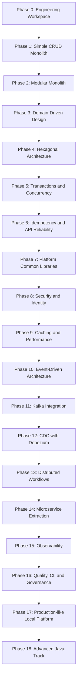

# 🧭 Atlas Billing Platform  
## A Staff Engineer / Java Architect Learning Blueprint

> **Goal:** Build one realistic software platform locally, evolving it from a simple CRUD application into a production-grade distributed system.  
> **Audience:** Senior Java Engineer moving toward Staff Engineer, Lead Engineer, or Software Architect.  
> **Constraint:** Everything must run on a local laptop using free and open-source tools.

---

## 1. Executive Summary

This blueprint is not a list of random exercises.

It is a single evolving product:

# **Atlas Billing Platform**

A fictional B2B SaaS company needs a platform to manage:

- customers
- subscription plans
- subscriptions
- invoices
- payments
- failed payment retries
- account balances
- financial ledger entries
- notifications
- fraud/suspicious activity checks
- internal reporting
- audit history
- service-to-service communication
- production-like operations

The system starts as a simple Spring Boot CRUD app and gradually evolves as business pressure increases.

Every technology appears only when the existing design becomes insufficient.

---

## 2. Why This Project?

Billing is a strong learning domain because it naturally forces serious engineering decisions.

| Business Need | Engineering Concept Introduced |
|---|---|
| Customers subscribe to plans | CRUD, REST, validation, persistence |
| Invoices must be correct | transactions, domain modeling, invariants |
| Payments can be retried | idempotency, API reliability |
| Money must be auditable | immutable ledger, append-only data |
| Multiple teams work on the same system | modular monolith, boundaries, architecture tests |
| Events must trigger notifications | outbox, async processing |
| Volume grows | Kafka, partitions, consumer groups |
| Data changes must be streamed | CDC, Debezium, WAL |
| Payment flow spans multiple steps | saga, orchestration, compensation |
| Payment changes faster than core billing | microservice extraction |
| Incidents happen | logs, metrics, traces, dashboards |
| Platform grows | shared libraries, starters, CI/CD, governance |

---

## 3. Core Local Technology Stack

| Area | Technology |
|---|---|
| Language | Java 21 baseline, with optional Java 25 notes |
| Framework | Spring Boot |
| Build | Maven multi-module |
| Database | PostgreSQL |
| ORM | Spring Data JPA / Hibernate |
| SQL-first access | Spring Data JDBC |
| Schema migrations | Flyway |
| Messaging | Apache Kafka in KRaft mode |
| Event extraction | Transactional Outbox first, Debezium CDC later |
| Cache | Caffeine + Redis |
| Security | Keycloak, OAuth2, OpenID Connect, JWT |
| Resilience | Resilience4j |
| Observability | OpenTelemetry, Prometheus, Grafana, Loki, Tempo |
| Testing | JUnit 5, AssertJ, Mockito, Testcontainers, WireMock, ArchUnit, Pact |
| Performance | JFR, JMC, VisualVM, JMH, JMeter or Gatling |
| Code Quality | Spotless, Checkstyle, SpotBugs, PMD, JaCoCo |
| Security Scanning | OWASP Dependency Check, Trivy, Gitleaks |
| Local Runtime | Docker Compose |
| Optional Final Platform | kind Kubernetes cluster |

---

## 4. Architecture Evolution Timeline



---

# Phase 0 — Engineering Workspace Foundation

## Business Goal

Create a consistent local environment so any developer can run the platform without manual setup.

## Technical Goal

Establish build governance, dependency control, and project structure before business code grows.

## Why This Phase Exists

A weak foundation creates version conflicts, broken builds, inconsistent local setups, and poor developer experience.

## Concepts Introduced

- Maven reactor
- parent POM
- BOM
- dependency management
- plugin management
- Maven Enforcer
- reproducible builds
- code formatting
- local developer automation

## Target Structure

```text
atlas-billing-platform/
  platform/
    platform-bom/
    platform-parent/
    platform-starters/
  shared/
  services/
  apps/
    billing-app/
  infrastructure/
    docker/
  observability/
  devops/
  docs/
    adr/
  scripts/
  sandbox/
```

## Architectural Decision

### Decision

Use a Maven multi-module monorepo.

### Why

At the beginning, refactoring speed matters more than independent deployment.

### Alternatives Considered

| Alternative | Why Rejected |
|---|---|
| Many repositories | Too much coordination before boundaries are known |
| Gradle | Good option, but Maven is still very common in enterprise Java |
| Single flat Maven project | Becomes hard to govern as modules grow |

### Trade-Offs

| Benefit | Cost |
|---|---|
| Easy refactoring | Monorepo can become large |
| Centralized dependency control | Requires build discipline |
| Consistent local commands | Initial setup takes time |

## Practical Implementation Tasks

- Create parent POM.
- Create dependency BOM.
- Add Maven Enforcer.
- Add Spotless.
- Add Checkstyle.
- Add JaCoCo.
- Add OWASP Dependency Check.
- Add Makefile.

```bash
make build
make test
make verify
make up
make down
make logs
```

## Deliverable

A repository that builds successfully with:

```bash
mvn clean verify
```

## Testing

At this phase, testing means build verification:

- dependency convergence
- Java version enforcement
- formatting checks
- test execution lifecycle

## Staff Engineer Perspective

| Question | Answer |
|---|---|
| What would a Senior Engineer focus on? | Making the project compile and run |
| What would a Staff Engineer notice? | Build consistency becomes a scaling problem |
| What risks exist? | Dependency drift, inconsistent plugins, slow builds |
| What future flexibility is preserved? | Easy module extraction later |
| What metrics matter? | Build time, test time, flaky test count |

---

# Phase 1 — Simple CRUD Monolith

## Business Goal

The company needs to onboard customers and sell subscription plans quickly.

## Technical Goal

Build the simplest working product.

## Scope

One Spring Boot application:

```text
billing-app
```

Initial capabilities:

- create customer
- create subscription plan
- create subscription
- list subscriptions
- generate simple invoice

## Concepts Introduced

- Spring Boot REST APIs
- controllers
- DTOs
- services
- repositories
- Spring Data JPA
- Hibernate basics
- PostgreSQL
- Flyway migrations
- validation
- global exception handling
- basic transaction management

## Architectural Decision

### Decision

Use one deployable Spring Boot monolith with one PostgreSQL database.

### Why

The fastest way to validate the product is to keep deployment, debugging, and transactions simple.

### Alternatives Considered

| Alternative | Why Rejected |
|---|---|
| Microservices | Domain boundaries are not yet known |
| Kafka-first design | No async pressure exists yet |
| CQRS | Read/write models are still simple |

### Trade-Offs

| Benefit | Cost |
|---|---|
| Very fast delivery | Weak internal boundaries |
| Simple debugging | Risk of big ball of mud |
| ACID transactions are easy | Scaling is mostly vertical at first |

## Practical Implementation Tasks

Create entities:

```text
CustomerEntity
PlanEntity
SubscriptionEntity
InvoiceEntity
```

Create endpoints:

```http
POST /api/v1/customers
POST /api/v1/plans
POST /api/v1/subscriptions
POST /api/v1/invoices/generate
GET  /api/v1/customers/{id}/subscriptions
```

Add:

- `application.yml`
- Flyway migration `V1__init_schema.sql`
- validation annotations
- global exception handler
- `@Transactional` application services

## Deliverable

A single application that can be started locally:

```bash
docker compose up postgres
mvn spring-boot:run
```

## Testing

| Test Type | Why It Exists |
|---|---|
| Unit tests | Validate business calculations |
| Integration tests | Verify JPA mappings and database behavior |
| Testcontainers PostgreSQL | Avoid H2 differences from real PostgreSQL |

## Performance Considerations

Measure:

- slow SQL queries
- missing indexes
- HikariCP connection acquisition time
- basic response latency

Tools:

- PostgreSQL logs
- `EXPLAIN ANALYZE`
- VisualVM for local JVM inspection

## Interview Topics

| Level | Topics |
|---|---|
| Senior | Spring lifecycle, JPA entity states, transactions, validation |
| Staff | Why monolith first, cost of premature distribution |
| System Design | CRUD service design, relational modeling, simple deployment |

---

# Phase 2 — Modular Monolith

## Business Goal

Different parts of the product are now owned by different teams:

- customer management
- catalog
- subscriptions
- invoicing
- payments
- ledger
- notifications

## Technical Goal

Prevent the monolith from becoming unmaintainable.

## Concepts Introduced

- modular monolith
- logical boundaries
- package-private implementation
- public module APIs
- ArchUnit
- dependency rules
- internal models vs public contracts

## Module Layout

```text
billing-app/
  customer/
  catalog/
  subscription/
  invoice/
  payment/
  ledger/
  notification/
```

## Architectural Decision

### Decision

Keep one deployable application, but enforce module boundaries.

### Why

The system needs architectural discipline, not operational distribution.

### Alternatives Considered

| Alternative | Why Rejected |
|---|---|
| Microservices | Adds network, observability, deployment, and data consistency problems too early |
| Separate repositories | Slows refactoring before boundaries stabilize |
| No boundaries | Guarantees future big ball of mud |

### Trade-Offs

| Benefit | Cost |
|---|---|
| Clean boundaries without distributed systems | Developers must respect public APIs |
| Easy refactoring | Some boilerplate added |
| Future service extraction becomes easier | Requires architecture tests |

## Practical Implementation Tasks

- Move code into module packages.
- Hide repositories and entities.
- Expose one public API per module.
- Add ArchUnit tests.
- Prevent direct cross-module repository access.

Example rule:

```java
classes()
  .that().resideInAPackage("..payment..")
  .should().onlyDependOnClassesThat()
  .resideInAnyPackage("..payment..", "..common..", "..ledger.api..");
```

## Deliverable

A single runnable app with enforced internal boundaries.

## Testing

| Test Type | Why It Exists |
|---|---|
| ArchUnit tests | Prevent boundary violations |
| Integration tests | Verify module collaboration |
| Testcontainers | Keep database behavior realistic |

## Staff Engineer Perspective

| Question | Answer |
|---|---|
| Senior focus | Clean package structure and services |
| Staff notice | Boundaries are team-scaling tools |
| Risk | `common` becomes a dumping ground |
| Future problem created | Public APIs may become too generic |
| Flexibility preserved | Modules can become services later |
| Metrics | Boundary violations, build time, module dependency count |

---

# Phase 3 — Domain-Driven Design

## Business Goal

Billing rules become more complex:

- free trials
- discounts
- taxes
- subscription suspension
- failed payment retries
- invoice state transitions
- payment state transitions

## Technical Goal

Move business rules into expressive domain objects.

## Concepts Introduced

- bounded context
- ubiquitous language
- aggregate
- entity
- value object
- domain service
- domain event
- invariant
- rich domain model

## Domain Model

```text
Customer
Plan
Subscription
Invoice
Payment
LedgerAccount
LedgerEntry
```

## Value Objects

```text
Money
Currency
CustomerId
SubscriptionId
InvoiceId
PaymentId
TaxRate
BillingPeriod
```

## Architectural Decision

### Decision

Use rich domain models for billing, invoice, payment, and ledger rules.

### Why

Billing logic becomes hard to reason about when it is scattered across procedural service methods.

### Alternatives Considered

| Alternative | Why Rejected |
|---|---|
| Anemic model | Simple at first, but rules become procedural spaghetti |
| Stored procedures | Harder to test, debug, and refactor |
| Rules engine | Too heavy before rule complexity justifies it |

### Trade-Offs

| Benefit | Cost |
|---|---|
| Better business expressiveness | More mapping code |
| Easier unit testing | Developers must learn domain modeling |
| Framework-independent rules | Requires discipline |

## Practical Implementation Tasks

- Create immutable `Money`.
- Add `Subscription.activate()`.
- Add `Subscription.cancel()`.
- Add `Invoice.markPaid()`.
- Add `Payment.fail()`.
- Add domain events:

```text
SubscriptionCreated
InvoiceGenerated
PaymentSucceeded
PaymentFailed
LedgerEntryPosted
```

## Deliverable

A domain layer that can be tested without Spring.

## Testing

| Test Type | Why It Exists |
|---|---|
| Pure unit tests | Domain rules should be fast and framework-free |
| Property-like tests | Useful for money calculations and invariants |
| State transition tests | Verify invoice/payment lifecycle correctness |

## Interview Topics

| Level | Topics |
|---|---|
| Senior | Entity vs value object, aggregate root, invariants |
| Staff | Bounded context design, modeling business language |
| System Design | Domain boundaries and data ownership |

---

# Phase 4 — Hexagonal Architecture

## Business Goal

The business expects future changes:

- different payment providers
- different notification providers
- different persistence strategies
- REST and event-based inputs

## Technical Goal

Decouple the business from frameworks and infrastructure.

## Concepts Introduced

- ports
- adapters
- dependency inversion
- inbound adapter
- outbound adapter
- application service
- anti-corruption layer
- persistence mapper

## Target Structure

```text
subscription/
  domain/
  application/
  port/
    in/
    out/
  adapter/
    in/
      web/
      messaging/
    out/
      postgres/
      paymentprovider/
```

## Architectural Decision

### Decision

Use hexagonal architecture inside important modules.

### Why

Core billing behavior should not depend directly on Spring MVC, JPA, Kafka, or external provider clients.

### Alternatives Considered

| Alternative | Why Rejected |
|---|---|
| Traditional controller-service-repository | Infrastructure leaks into business code |
| Full clean architecture with many rings | Too much ceremony for current size |
| Keep JPA entities as domain | Couples business model to persistence model |

### Trade-Offs

| Benefit | Cost |
|---|---|
| Infrastructure can be replaced | More classes and mapping |
| Domain becomes testable | More architecture discipline |
| Clear boundaries | Slower initial coding |

## Practical Implementation Tasks

Create inbound ports:

```java
CreateSubscriptionUseCase
CancelSubscriptionUseCase
GenerateInvoiceUseCase
```

Create outbound ports:

```java
LoadCustomerPort
SaveSubscriptionPort
PaymentProviderPort
LedgerPostingPort
```

Move:

- REST controllers to inbound adapters
- JPA repositories to outbound adapters
- domain model away from Spring annotations

## Deliverable

A codebase organized around business capabilities, not framework layers.

---

# Phase 5 — Persistence, Transactions, and Concurrency

## Business Goal

Payments and ledger entries must be correct under concurrent usage.

## Technical Goal

Learn real transaction boundaries and database consistency.

## Concepts Introduced

- ACID
- transaction isolation
- optimistic locking
- pessimistic locking
- deadlocks
- transaction propagation
- Hibernate dirty checking
- Hibernate first-level cache
- N+1 query problem
- indexes
- execution plans
- connection pools

## Architectural Decision

### Decision

Use an append-only double-entry ledger instead of only mutable balance fields.

### Why

Financial history must be auditable and reconstructable.

### Alternatives Considered

| Alternative | Why Rejected |
|---|---|
| Mutable balance only | Easy to corrupt and hard to audit |
| Java `synchronized` | Breaks when multiple app instances exist |
| Distributed lock | Operationally heavy this early |

### Trade-Offs

| Benefit | Cost |
|---|---|
| Strong auditability | More complex queries |
| Better correctness | Requires ledger thinking |
| Easier reconciliation | Need projections for fast reads |

## Practical Implementation Tasks

- Create `ledger_entries` table.
- Add debit and credit entries.
- Add optimistic locking for subscription updates.
- Add pessimistic locking for payment finalization.
- Add indexes.
- Use `EXPLAIN ANALYZE`.
- Simulate 50 concurrent payment requests.

## Deliverable

A concurrency-safe billing flow with auditable ledger entries.

## Testing

| Test Type | Why It Exists |
|---|---|
| Concurrent integration tests | Prove correctness under race conditions |
| Testcontainers PostgreSQL | Real locks and isolation behavior |
| Repository tests | Verify mappings, queries, and indexes |

---

# Phase 6 — Idempotency and API Reliability

## Business Goal

A user may retry a payment request after a timeout. The system must not double-charge.

## Technical Goal

Make external APIs safe under retries.

## Concepts Introduced

- idempotency key
- retry-safe API design
- request deduplication
- unique constraints
- request hash
- RFC 7807 Problem Details
- correlation IDs
- replay protection

## Architectural Decision

### Decision

Require `Idempotency-Key` for payment and invoice-generation commands.

### Why

Network retries are normal. Duplicate side effects are unacceptable.

### Alternatives Considered

| Alternative | Why Rejected |
|---|---|
| Rely on frontend disabling buttons | Does not solve network retries |
| Use database uniqueness only | Does not preserve original response |
| Ignore duplicate requests | Financially unsafe |

## Practical Implementation Tasks

- Add `Idempotency-Key` header validation.
- Store key, request hash, status, and response.
- Reject same key with different payload.
- Replay stored response for duplicate identical requests.
- Add correlation ID filter.
- Add structured problem responses.

## Deliverable

Payment APIs that are safe under client retries.

---

# Phase 7 — Platform Common Libraries

## Business Goal

Repeated platform code appears across modules and future services.

## Technical Goal

Extract reusable infrastructure carefully.

## Concepts Introduced

- internal platform libraries
- Spring Boot starters
- auto-configuration
- conditional beans
- AOP
- MDC
- ThreadLocal
- ScopedValue
- virtual thread context propagation
- Jackson modules
- validation internals

## Platform Modules

```text
common-core
common-web
common-errors
common-logging
common-security
common-validation
common-jackson
common-cache
```

## Architectural Decision

### Decision

Create focused shared libraries and starters.

### Why

Some concerns are truly cross-cutting: errors, logging, validation, JSON, security, caching.

### Alternatives Considered

| Alternative | Why Rejected |
|---|---|
| Copy-paste per module | Inconsistent behavior |
| One giant common module | Becomes a dumping ground |
| External platform too early | More process than value |

## Practical Implementation Tasks

- Create `common-errors`.
- Create `common-web` with exception handling.
- Create `common-logging` with JSON logs and MDC.
- Create `common-jackson` for `Money`.
- Create `common-validation`.
- Create `common-cache`.
- Create Spring Boot starters.

## Staff Engineer Rule

A class belongs in a shared library only if the same problem exists in multiple places.

---

# Phase 8 — Security and Identity

## Business Goal

Customers, admins, and internal services need different access levels.

## Technical Goal

Secure APIs locally with real identity concepts.

## Concepts Introduced

- OAuth2
- OpenID Connect
- JWT
- Keycloak
- RBAC
- ABAC
- Spring Security filter chain
- method security
- token relay
- service-to-service authentication

## Architectural Decision

### Decision

Use Keycloak locally as the identity provider.

### Why

It teaches realistic auth flows without paid cloud services.

### Alternatives Considered

| Alternative | Why Rejected |
|---|---|
| Hardcoded users | Unrealistic |
| Basic auth | Not representative of modern systems |
| SaaS identity provider | Violates local-first constraint |

## Practical Implementation Tasks

- Run Keycloak in Docker Compose.
- Create realm.
- Create users and roles.
- Secure REST APIs.
- Add JWT validation.
- Add `tenantId` claim.
- Add `@PreAuthorize`.
- Add ownership checks.
- Add JWT integration tests.

## Deliverable

Secured APIs with realistic local authentication and authorization.

---

# Phase 9 — Caching and Performance

## Business Goal

Plan catalog, tax rates, and entitlement checks are read frequently.

## Technical Goal

Reduce database pressure without corrupting business state.

## Concepts Introduced

- cache-aside
- write-through
- write-behind
- Redis
- Caffeine
- TTL
- cache invalidation
- hot keys
- thundering herd
- stale data
- local vs distributed cache

## Architectural Decision

### Decision

Use Caffeine for local reference data and Redis for shared cache/idempotency state.

### Why

Some data is safe to keep local; some must be shared across instances.

### Alternatives Considered

| Alternative | Why Rejected |
|---|---|
| Cache everything in Redis | Adds network hop for local reference data |
| Cache everything locally | Inconsistent across app instances |
| No cache | Database becomes bottleneck |

## Practical Implementation Tasks

- Cache plan catalog with Caffeine.
- Cache tax rates with Redis.
- Add cache metrics.
- Add cache invalidation events.
- Simulate cache stampede.
- Add protection with locks or early refresh.

## Staff Engineer Lesson

Caching is not just performance. It is a consistency decision.

---

# Phase 10 — Event-Driven Architecture

## Business Goal

Invoice creation should trigger:

- email notification
- payment attempt
- ledger posting
- analytics update

The invoice request should not wait for all of them.

## Technical Goal

Introduce asynchronous communication safely.

## Concepts Introduced

- domain events
- integration events
- transactional outbox
- eventual consistency
- at-least-once delivery
- duplicate handling
- event versioning

## Architectural Decision

### Decision

Use the transactional outbox before Kafka.

### Why

The team must first understand the consistency problem before adding messaging infrastructure.

### Alternatives Considered

| Alternative | Why Rejected |
|---|---|
| Publish directly to Kafka inside transaction | Dual-write risk |
| XA transactions | Too complex and slow |
| Ignore failures | Unacceptable for billing |

## Practical Implementation Tasks

- Create `outbox_events` table.
- Store events in same transaction as invoice/payment changes.
- Add outbox poller.
- Add event dispatcher.
- Add idempotent consumers.
- Add retry and dead-letter table.

## Deliverable

A reliable local event-driven architecture without Kafka yet.

---

# Phase 11 — Kafka Integration

## Business Goal

The platform needs scalable event distribution and multiple independent consumers.

## Technical Goal

Move from local event dispatching to Kafka-based event streams.

## Concepts Introduced

- Kafka topics
- partitions
- consumer groups
- offsets
- rebalancing
- ordering guarantees
- partition keys
- schema evolution
- retry topics
- dead-letter topics

## Topics

```text
billing.invoice.generated
billing.payment.succeeded
billing.payment.failed
billing.ledger.posted
billing.subscription.cancelled
```

## Architectural Decision

### Decision

Publish outbox events to Kafka with explicit partition keys.

### Why

Consumers can scale independently, but ordering must be designed intentionally.

### Alternatives Considered

| Alternative | Why Rejected |
|---|---|
| RabbitMQ | Good broker, but weaker for replay and stream processing |
| Redis Streams | Useful, but Kafka is more common for event streaming |
| Direct REST callbacks | Tight coupling and retry complexity |

## Practical Implementation Tasks

- Run Kafka in KRaft mode locally.
- Add Schema Registry.
- Publish outbox events to Kafka.
- Add consumers.
- Add retry topics.
- Add DLQ.
- Add consumer lag metrics.
- Use `customerId` or `subscriptionId` as partition key based on ordering needs.

## Staff Engineer Lesson

Kafka is not async magic. You must decide what ordering you need and for which entity.

---

# Phase 12 — CDC with Debezium

## Business Goal

Outbox polling starts putting pressure on the database.

## Technical Goal

Use PostgreSQL logs instead of application polling.

## Concepts Introduced

- PostgreSQL WAL
- logical replication
- Debezium
- Kafka Connect
- CDC
- event routing
- operational ownership

## Architectural Decision

### Decision

Use Debezium to capture outbox rows from the PostgreSQL WAL.

### Why

CDC reduces application polling pressure and improves event extraction latency.

### Alternatives Considered

| Alternative | Why Rejected |
|---|---|
| Keep polling forever | Causes DB pressure at scale |
| Publish directly from app | Reintroduces dual-write risk |
| Database triggers | Harder to version and test |

## Practical Implementation Tasks

- Enable `wal_level=logical`.
- Add Debezium connector.
- Capture `outbox_events`.
- Route events to Kafka topics.
- Remove application poller.
- Compare polling vs CDC.

## Deliverable

A CDC-based event publishing pipeline.

---

# Phase 13 — Distributed Workflows

## Business Goal

Payment collection becomes multi-step:

1. invoice generated
2. payment attempted
3. fraud check
4. ledger posted
5. email sent
6. subscription activated or suspended

## Technical Goal

Coordinate long-running business workflows without distributed transactions.

## Concepts Introduced

- saga pattern
- choreography
- orchestration
- compensation
- timeout
- retry
- workflow state machine
- eventual consistency

## Architectural Decision

### Decision

Start with choreography, then implement lightweight orchestration when visibility becomes hard.

### Why

Simple flows work well with events. Complex flows need central visibility.

### Alternatives Considered

| Alternative | Why Rejected |
|---|---|
| Distributed transactions | Poor scalability and operational complexity |
| Workflow engine immediately | Hides fundamentals too early |
| Pure choreography forever | Hard to debug complex payment flows |

## Practical Implementation Tasks

- Implement payment saga.
- First use Kafka choreography.
- Then implement a lightweight orchestrator in Java.
- Add compensation:

```text
PaymentAuthorized -> LedgerPostFailed -> PaymentReversed
```

## Deliverable

A reliable multi-step payment flow with compensation.

---

# Phase 14 — Microservice Extraction

## Business Goal

Payment processing now changes faster and scales differently from subscription management.

## Technical Goal

Extract the first service for a real reason.

## Extracted Services

```text
billing-monolith
payment-service
notification-service
ledger-service
```

## Concepts Introduced

- service ownership
- database per service
- API contracts
- backward compatibility
- service-to-service calls
- network failure
- distributed tracing
- contract testing

## Architectural Decision

### Decision

Extract `payment-service` first.

### Why

Payment has external provider integration, retry complexity, and different failure isolation needs.

### Alternatives Considered

| Alternative | Why Rejected |
|---|---|
| Extract customer first | Too simple, low value |
| Extract everything | Big-bang distributed complexity |
| Keep all forever | Payment failures can hurt core billing |

## Practical Implementation Tasks

- Create `payment-service`.
- Give it its own PostgreSQL database.
- Communicate through REST for commands.
- Publish payment events through Kafka.
- Add Pact contract tests.
- Add WireMock tests.
- Add Resilience4j retries, timeouts, and circuit breakers.

## Deliverable

A hybrid system: modular monolith plus extracted payment service.

---

# Phase 15 — Observability

## Business Goal

When a payment fails, engineers must know why.

## Technical Goal

Make the platform debuggable.

## Concepts Introduced

- structured logs
- metrics
- traces
- OpenTelemetry
- Prometheus
- Grafana
- Loki
- Tempo
- RED metrics
- USE metrics
- SLOs
- alerting

## Architectural Decision

### Decision

Use OpenTelemetry for tracing and metrics propagation, with Prometheus, Grafana, Loki, and Tempo locally.

### Why

It gives production-like debugging without vendor lock-in.

### Alternatives Considered

| Alternative | Why Rejected |
|---|---|
| Logs only | Insufficient for distributed systems |
| Metrics only | Shows symptoms but not causal path |
| Vendor SaaS tool | Violates local-first constraint |

## Practical Implementation Tasks

- Add OpenTelemetry Java agent.
- Add trace propagation across REST and Kafka.
- Add correlation IDs.
- Add JSON logs.
- Add trace IDs to logs.
- Add business metrics:

```text
invoices.generated.total
payments.succeeded.total
payments.failed.total
ledger.posting.duration
kafka.consumer.lag
```

- Build Grafana dashboards.

## Deliverable

A locally observable distributed billing platform.

---

# Phase 16 — Quality, CI, and Governance

## Business Goal

The platform now has multiple modules and services. Quality must not rely on memory or manual discipline.

## Technical Goal

Automate engineering standards.

## Concepts Introduced

- CI pipeline
- quality gates
- static analysis
- dependency scanning
- container scanning
- mutation testing
- architecture tests
- test pyramid
- build reproducibility
- ADRs

## Architectural Decision

### Decision

Automate governance in the build pipeline.

### Why

Architecture rules that are not automated eventually become suggestions.

### Alternatives Considered

| Alternative | Why Rejected |
|---|---|
| Code review only | Human review misses repeated issues |
| Documentation only | Docs drift from code |
| Manual release checklist only | Not scalable |

## Practical Implementation Tasks

- Add GitHub Actions.
- Add JaCoCo thresholds.
- Add ArchUnit checks.
- Add OWASP Dependency Check.
- Add Trivy.
- Add Gitleaks.
- Add SonarQube Community locally.
- Add ADR template.
- Add PR checklist.

## Deliverable

A repository where quality and architecture are enforced automatically.

---

# Phase 17 — Production-like Local Platform

## Business Goal

The company wants confidence before production deployment.

## Technical Goal

Run locally like a small production system.

## Concepts Introduced

- Docker Compose profiles
- health checks
- readiness
- liveness
- resource limits
- graceful shutdown
- container-aware JVM
- secrets
- configuration
- kind Kubernetes cluster

## Docker Compose Profiles

```text
minimal:
  postgres
  billing-app

dev:
  postgres
  redis
  keycloak
  kafka
  schema-registry

observability:
  prometheus
  grafana
  loki
  tempo
  otel-collector

full:
  everything
```

## Architectural Decision

### Decision

Use Docker Compose first, then optionally kind Kubernetes.

### Why

Docker Compose is enough until orchestration itself becomes the thing being learned.

### Alternatives Considered

| Alternative | Why Rejected |
|---|---|
| Kubernetes from day one | Too much platform complexity too early |
| Cloud platform | Violates local-first constraint |
| Manual local installs | Inconsistent developer machines |

## Practical Implementation Tasks

- Add health endpoints.
- Add readiness checks.
- Add liveness checks.
- Add graceful shutdown.
- Add resource limits.
- Add local secrets via `.env`.
- Add optional kind manifests.

## Deliverable

A local production-like platform runnable from a laptop.

---

# Phase 18 — Advanced Java Track Inside the Same Project

Advanced Java should not be separate exercises. Add it when the platform needs it.

| Java Concept | Where It Appears |
|---|---|
| Records | DTOs, commands, events |
| Sealed classes | payment states, invoice states |
| Pattern matching | event handling |
| Streams | reporting and projections |
| Virtual threads | blocking IO workloads |
| Structured concurrency | parallel fraud and payment provider calls |
| CompletableFuture | comparison with structured concurrency |
| Reflection | custom validation and annotation scanning |
| Annotation processing | mapper or metadata generation |
| ThreadLocal | correlation ID and MDC |
| ScopedValue | safer context propagation with virtual threads |
| GC tuning | load testing payment service |
| JFR / JMC | production-like performance investigation |
| JMH | benchmark money calculations, serializers, mappers |
| Class loading | plugin-like payment provider adapters |

---

# Decision Log

| Decision | Phase | Why Chosen | Alternatives | Trade-Offs |
|---|---:|---|---|---|
| Maven monorepo | 0 | Fast refactoring and centralized governance | Multi-repo, flat project | Easier consistency, but repo can grow large |
| Monolith first | 1 | Fast product validation | Microservices, Kafka-first | Simple now, boundaries weak |
| Modular monolith | 2 | Enforce internal boundaries | Microservices, no boundaries | Good discipline, some boilerplate |
| Rich domain model | 3 | Complex billing rules need invariants | Anemic model, stored procedures | Better correctness, more mapping |
| Hexagonal architecture | 4 | Decouple business from frameworks | Layered architecture | More classes, higher flexibility |
| Append-only ledger | 5 | Auditability and correctness | Mutable balance | More query complexity |
| Idempotency keys | 6 | Safe retries | UI-only protection, uniqueness only | More storage, safer APIs |
| Platform libraries | 7 | Reuse repeated infrastructure | Copy-paste, giant common | Better consistency, risk of over-abstraction |
| Keycloak | 8 | Realistic local identity | Basic auth, SaaS IDP | More setup, better realism |
| Redis + Caffeine | 9 | Balance local speed and shared state | Redis only, local only | Consistency decisions needed |
| Transactional outbox | 10 | Avoid dual-write problem | Direct Kafka publish, XA | Reliable, adds event table |
| Kafka | 11 | Scalable event distribution | RabbitMQ, REST callbacks | Powerful, operationally heavier |
| Debezium CDC | 12 | Reduce polling pressure | Polling forever, triggers | Better scale, more infra |
| Saga workflow | 13 | Long-running consistency | Distributed transactions | More eventual consistency reasoning |
| Extract payment service | 14 | Different scaling and failure profile | Extract all, extract customer | Valuable isolation, more distributed complexity |
| OpenTelemetry stack | 15 | Debug distributed flows | Logs only, SaaS tool | Better diagnosis, more setup |
| Automated governance | 16 | Prevent drift | Review only, docs only | Strong gates, more pipeline work |
| Docker Compose first | 17 | Local-first simplicity | K8s first, cloud | Easier learning, less production parity |

---

# Concept Coverage Matrix

| Concept | Phase Introduced | Reason |
|---|---:|---|
| Maven reactor | 0 | Multi-module build foundation |
| BOM/dependency management | 0 | Prevent version drift |
| Spring Boot REST | 1 | Basic API delivery |
| JPA/Hibernate | 1 | Relational persistence |
| Flyway | 1 | Versioned database schema |
| Testcontainers | 1 | Realistic integration tests |
| Modular monolith | 2 | Team-scale codebase structure |
| ArchUnit | 2 | Automated boundary enforcement |
| DDD | 3 | Complex business rules |
| Value objects | 3 | Money and identity correctness |
| Aggregates | 3 | Protect invariants |
| Hexagonal architecture | 4 | Decouple core from infrastructure |
| Ports/adapters | 4 | Replaceable infrastructure |
| ACID transactions | 5 | Payment correctness |
| Optimistic locking | 5 | Prevent lost updates |
| Pessimistic locking | 5 | Serialize critical payment operations |
| N+1 query optimization | 5 | Database performance |
| Idempotency | 6 | Safe API retries |
| RFC 7807 | 6 | Standard error responses |
| Correlation ID | 6 | Request tracking |
| Platform libraries | 7 | Reusable cross-cutting concerns |
| Spring Boot starters | 7 | Auto-configured internal platform |
| ThreadLocal / ScopedValue | 7 | Context propagation |
| OAuth2/OIDC/JWT | 8 | Real authentication |
| RBAC/ABAC | 8 | Authorization rules |
| Redis | 9 | Shared cache and idempotency state |
| Caffeine | 9 | Fast local reference cache |
| Outbox pattern | 10 | Reliable async events |
| Eventual consistency | 10 | Async business flows |
| Kafka | 11 | Scalable messaging |
| Partitions/consumer groups | 11 | Scale and ordering |
| Schema evolution | 11 | Event compatibility |
| Debezium | 12 | CDC event publishing |
| PostgreSQL WAL | 12 | Logical replication |
| Saga | 13 | Distributed workflow consistency |
| Compensation | 13 | Recover failed workflow steps |
| Microservice extraction | 14 | Real service boundary |
| Contract testing | 14 | API compatibility |
| Resilience4j | 14 | Network failure handling |
| OpenTelemetry | 15 | Distributed tracing |
| Prometheus/Grafana | 15 | Metrics and dashboards |
| Loki/Tempo | 15 | Logs and traces |
| CI/CD quality gates | 16 | Automated governance |
| Docker Compose profiles | 17 | Local operational realism |
| Advanced Java | 18 | Applied language mastery |

---

# Testing Strategy Evolution

| Phase | Testing Focus |
|---:|---|
| 0 | Build verification |
| 1 | Unit + integration with PostgreSQL Testcontainers |
| 2 | ArchUnit boundary tests |
| 3 | Pure domain unit tests |
| 4 | Port and adapter tests |
| 5 | Concurrency and transaction tests |
| 6 | Idempotency replay and duplicate protection tests |
| 7 | Starter auto-configuration tests |
| 8 | JWT and authorization tests |
| 9 | Cache consistency and stampede tests |
| 10 | Outbox reliability tests |
| 11 | Kafka consumer/producer integration tests |
| 12 | CDC pipeline tests |
| 13 | Saga success, failure, timeout, compensation tests |
| 14 | Contract tests and WireMock tests |
| 15 | Observability smoke tests |
| 16 | Quality gates |
| 17 | End-to-end local platform tests |

---

# Performance Learning Path

| Tool | When to Use | What You Learn |
|---|---|---|
| VisualVM | Early local inspection | threads, heap, CPU basics |
| PostgreSQL `EXPLAIN ANALYZE` | Phase 5 | query plans and indexes |
| JFR | Phase 7+ | production-like JVM profiling |
| JMC | Phase 7+ | interpreting JFR recordings |
| JMH | Phase 18 | microbenchmarking correctly |
| JMeter/Gatling | Phase 5+ | API load testing |
| Kafka consumer lag metrics | Phase 11 | async throughput bottlenecks |
| Grafana dashboards | Phase 15 | system-level observability |

---

# What to Avoid Early

| Avoid Early | Reason |
|---|---|
| Kubernetes | Adds platform complexity before application complexity exists |
| Istio/service mesh | Too heavy for a local-first learning system |
| Full GitOps | Useful later, distracting early |
| Camunda/Temporal | Learn saga fundamentals first |
| GraphQL Federation | Only useful after many APIs exist |
| Elasticsearch | Add only if search becomes a real business requirement |
| Cassandra/MongoDB | PostgreSQL is enough for this learning path |
| Cloud services | Violates local-first constraint |
| Big-bang microservices | Creates artificial distributed problems |

---

# Staff Engineer Retrospective

## Most Important Architectural Decisions

1. Start with a monolith.
2. Enforce modular boundaries before extracting services.
3. Move business rules into the domain.
4. Introduce hexagonal architecture only when infrastructure coupling becomes painful.
5. Use idempotency before distributed messaging.
6. Use outbox before Kafka.
7. Extract services only when there is a real business and operational reason.
8. Add observability before the system becomes too hard to debug.

## Decisions That Would Change at Larger Scale

At much larger scale, you may introduce:

- Kubernetes earlier
- dedicated platform team
- service mesh
- stronger release governance
- dedicated data platform
- managed Kafka
- stronger compliance automation
- advanced deployment strategies

## Decisions That Would Change in a Startup

A startup may delay:

- platform libraries
- strict governance
- CDC
- microservice extraction
- complex authorization

The priority would be speed and product validation.

## Decisions That Would Change in a Bank

A bank would introduce earlier:

- audit controls
- segregation of duties
- stricter security
- immutable logs
- formal change management
- compliance reporting
- stronger disaster recovery
- data retention policies

## Biggest Operational Lessons

- Every retry needs idempotency.
- Every async consumer must handle duplicates.
- Every distributed flow needs observability.
- Every service boundary adds operational cost.
- Kafka improves decoupling but increases ownership complexity.

## Biggest Maintainability Lessons

- A `common` module can destroy architecture if uncontrolled.
- Domain purity requires discipline.
- Boundaries must be tested, not just documented.
- Architecture should evolve from pain, not fashion.

## Biggest Distributed Systems Lessons

- Network calls fail.
- Events arrive more than once.
- Ordering is scoped, not global.
- Consistency is a business decision.
- Observability is part of the architecture.

---

# Final Learning Journey

```text
Simple CRUD
  -> Modular Monolith
  -> Domain-Driven Design
  -> Hexagonal Architecture
  -> Transactions and Locking
  -> Idempotency
  -> Platform Libraries
  -> Security
  -> Caching
  -> Outbox
  -> Kafka
  -> CDC
  -> Distributed Workflows
  -> Microservice Extraction
  -> Observability
  -> CI/CD Governance
  -> Production-like Local Platform
  -> Advanced Java Mastery
```

---

## Final Principle

Do not add technology because it is popular.

Add it when the current architecture has a real limitation.

That is the difference between learning tools and learning architecture.
